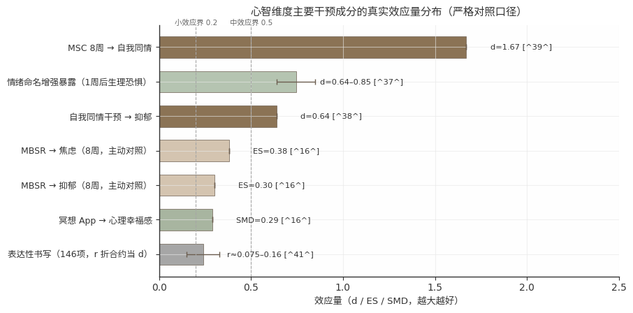
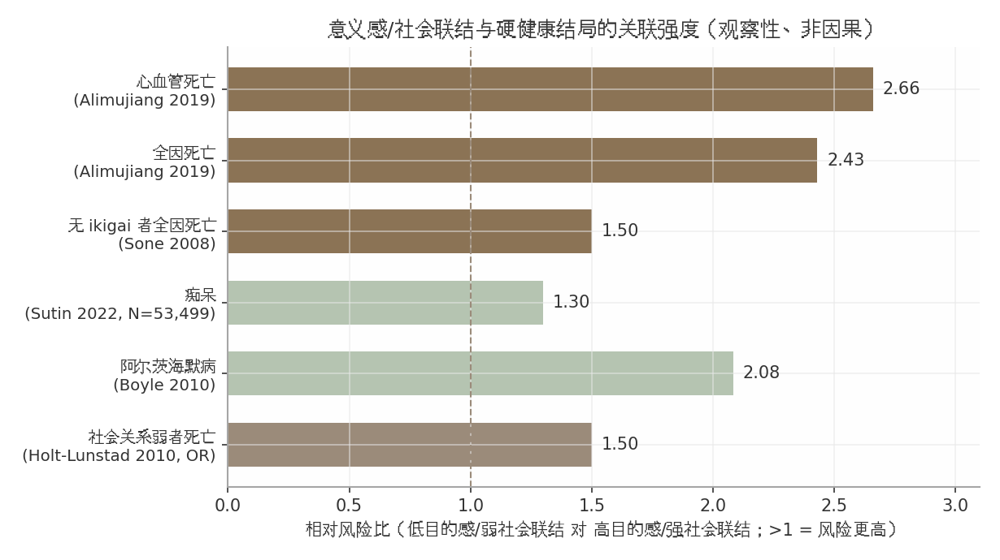
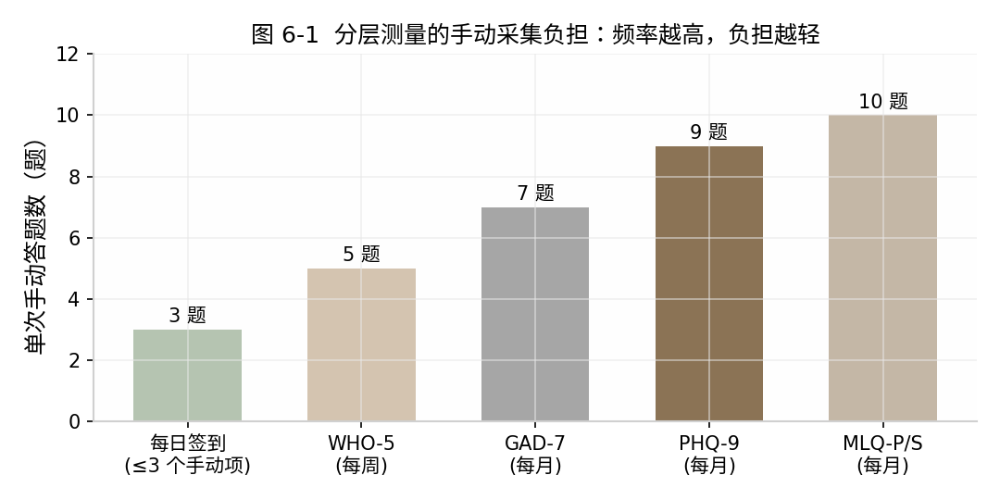

# 每日训练大脑·心智·灵魂：深度分析报告与完整产品方案

## 执行摘要

**结论先行：一个把「大脑（认知）—心智（情绪）—灵魂（意义）」三维循证练习编排为单一每日回路的自用 PWA，AI 担任引导者而非治疗师，是证据与市场共同指向的最优形态。** 为什么三维合一而非三个 App？市场上所有二维组合（心+灵、脑+习惯、心+游戏化）均已有头部产品，宣称 Mind/Body/Soul 合一的仅剩无循证背书的玄学向玩家，三维交叉是真实空白 [^96^][^97^]。更根本的理由在机制：三维不是并列模块，而是「身体供能→情绪稳定→意义定向」的因果链——有氧运动是心智练习生效的生理前提 [^3^]，目的感又反过来预测更好的健康行为 [^42^]，拆成三个 App 等于切断回路。

**三维证据地图：有效杠杆分布严重不均，资源须按证据而非直觉配置。**

| 维度 | 最强成分 | 证据等级 | 效应量/硬终点 |
|---|---|---|---|
| 大脑（认知） | 有氧运动 + 多域生活方式打包；UFOV 式自适应处理速度训练 | 高（运动/多域）；中高（UFOV，单一试验系列） | 一年快走海马体积 +2% [^3^]；FINGER 多域干预总体认知较对照 +25% [^5^]；UFOV 十年随访痴呆风险 −29%（HR 0.71）[^1^] |
| 心智（情绪） | 8 周 MBSR/MBCT 正念课程（每日 10–13 分钟） | 高（全报告唯一「与药物比较」级证据） | MBSR 治疗焦虑非劣于艾司西酞普兰，不良事件 15.4% vs 78.6% [^13^]；MBCT 抑郁 60 周复发风险 −31%（HR 0.69）[^14^] |
| 灵魂（意义） | 目的感/意义练习（最佳可能自我、遗产文档等） | 中（观察性关联，非因果） | 最低 vs 最高目的感组全因死亡 HR≈2.43 [^42^]；目的感与痴呆风险 HR 0.77（六队列 N=53,499）[^45^] |

地图揭示三个反直觉事实：其一，大脑维度真正有效的杠杆在 App 之外——运动、生活方式打包与有真实生活迁移的 UFOV 式训练，「脑训练游戏」不在其中；其二，心智维度效应量虽小，却是全三维唯一经受「与药物头对头比较」检验的维度，构成方案合法性基石；其三，灵魂维度是唯一与死亡率、痴呆硬结局关联的维度，但全部为观察性关联，因果表述即是越界。据此，大脑模块第一优先级给运动联动而非认知游戏，正念课程定为核心干预单元，意义练习定位为「可训练的健康变量」。

**三个争议必须诚实呈现，诚实本身即是合规要求与差异化。** 第一，脑训练远迁移薄弱已成共识——n-back 远迁移 g 仅约 0.16 且复制不稳定，FTC 曾以虚假宣传处罚 Lumosity 200 万美元 [^6^][^7^]；产品关于页须写明「不承诺提升智力或预防痴呆」。第二，冥想「重塑大脑」式宣传在更严格设计中未复现（n=218 三臂 RCT 无任何结构性脑改变）[^21^]；感恩存在「高频有效」与「高频习惯化」之争，裁决为启动期每日、维持期降频的两阶段剂量 [^32^][^33^]。第三，AI 陪伴是双刃剑：四周 RCT（n=981）显示用量越高，孤独、依赖与现实社交退缩越重；Character.AI 诉讼暴露了「自称治疗师+危机响应缺失」的致命模式 [^82^][^98^]。

**方案核心决策一页览。** ①每日回路为「晨启动—日微剂量—晚卸载」：晨间借光照与运动定向并写下 if-then 意图，晚间以「写明日 to-do」做认知卸载（入睡快约 9 分钟）并以三件好事收尾 [^76^][^71^]。②分维度游戏化：大脑重度（分数/等级）、心智轻量（streak+freeze）、灵魂去 KPI（仅 ✓/✗、断签零惩罚）——依据是可预期有形奖励削弱内在动机 d=−0.28~−0.40 [^66^]，而 streak 机制的留存收益同为实测证据 [^68^]。③量表分层：每日 ≤3 个手动项、每周 WHO-5、每月 PHQ-9/GAD-7 与 MLQ（Presence 与 Search 分开画线）[^92^][^93^][^91^]。④PWA+本地存储，AI 分级路由——私密日记走本地 7B–13B 模型，课程生成走云端 API [^84^]。最终判据只有一条：心理类 App 30 天留存中位数仅 3.3% [^20^]，坚持系统是第一疗效成分，内容只是其载体。

## 1. 大脑维度：认知训练的科学证据与有效成分

**本章结论先行：大脑维度真正有效的杠杆大多不在脑训练游戏里，而在游戏之外——有氧运动、多域生活方式、真实新技能与间隔学习；App 内的认知训练只保留一个中等证据成分（UFOV 式处理速度训练），且其作用是把用户引向这些 App 外行为。** 这一排序直接决定了本报告产品方案的资源分配：运动联动与新技能挑战是一等模块，游戏化训练是补充件，「提升智力、预防痴呆」类宣称永久禁用。

### 1.1 争议与红线：脑训练游戏为什么大多无效

#### 1.1.1 三方互证「远迁移薄弱」

脑训练产业的「玩什么只擅长什么」已由学术、复制与监管三条独立证据链交叉确认。学术侧，Simons et al. 2016 年发表于《公共利益心理科学》的大型综述系统审查后认定：脑训练能可靠提升被训练任务本身的成绩，但证据不足以支持其迁移到日常认知、学业与工作表现 [^6^]。复制侧，Melby-Lervåg et al. 2016 的元分析与 Redick et al. 2013 的活性对照 RCT 均显示工作记忆训练的近/远迁移为零或接近零 [^6^][^8^]——后者用 20 次×40 分钟的大剂量双 n-back 训练，任务成绩大幅提升并保持 6 个月，但未训练指标上没有任何迁移 [^8^]。监管侧，FTC 2016 年以虚假广告处罚 Lumosity，200 万美元和解，其认定措辞值得全文引用：该公司宣称的认知能力提升「只是游戏熟练的结果」 [^7^]。三条链来源独立、方法互补、结论一致，构成本报告全篇的合规红线：任何认知训练的叙事只能承诺「练的那项能力」。

#### 1.1.2 近迁移与远迁移的量化落差

远迁移的薄弱不是「有或无」之争，而是一条可量化的衰减曲线。n-back 训练元分析显示，效应量随任务相似性逐级递减：未训练的 n-back 任务 g≈0.44（中等、可靠），其他工作记忆任务 g≈0.22，认知控制 g≈0.19，到流体智力仅 g≈0.16 且复制不稳定 [^6^][^8^]。换言之，训练收益每远离训练任务一步就腰斩一次，到「智力」层面已接近测量噪声。美国国家老龄研究所（NIA）的官方立场与此吻合：明确警告市售脑训练应用没有与 ACTIVE 试验等效的证据 [^12^]。对产品方案的含义是双重的：架构上，n-back 类游戏只能定位为留存工具与专注启动器（用户能看到分数进步，分数本身即其全部价值）；文案上，其功效叙事上限是「训练专注力」，严禁触碰智力宣称。

![n-back 训练迁移效应随任务相似性衰减（数据：g≈0.44/0.22/0.19/0.16）[^6^][^8^]](mindtraining_sec01_fig1.png)

#### 1.1.3 【冲突区 C5/C16 双面呈现】冥想对认知与脑结构：阳性小样本 vs 阴性大 RCT

这是脑健康宣传的重灾区，必须双面呈现后给出裁决。**阳性侧**：Mrazek et al. 2013 报告 2 周正念训练提升工作记忆与 GRE 阅读成绩 [^22^]；Hölzel et al. 2011 的小样本研究（n=16，无主动对照）报告 8 周 MBSR 后海马灰质密度增加 [^99^]。这组结果是市面上「8 周冥想重塑大脑」文案的全部学术来源。**阴性侧**：JAMA 2022 年发表的大型 2×2 RCT（n=585，18 个月）显示 MBSR 对有主观认知主诉老年人的情节记忆与执行功能均无显著效应；Kral et al. 2022 年 n=218 三臂 RCT 则发现 MBSR 不产生任何结构性脑改变 [^21^]。**裁决原则**：小样本、无主动对照的阳性结果在更大更严格的随机设计中未能复现——结构改变方向的证据已被明确否定，功能与行为层面（专注、减少走神）的证据相对稳但量级有限。输出两条设计决策：其一，文案红线——禁用「冥想重塑大脑/提升智力」，可用「训练专注、减少走神、改善情绪调节」；其二，架构归属——冥想的稳健获益在情绪调节而非认知增强，**冥想模块整体归入第 2 章心智维度**，大脑维度不为它承担功效叙事。

### 1.2 有效成分：证据等级从高到低排序

#### 1.2.1 UFOV 处理速度训练：唯一有长期硬终点的认知训练成分（medium-high）

ACTIVE 试验（N=2832，迄今最大认知训练 RCT）十年随访显示，三种训练中仅 UFOV 处理速度训练组的痴呆风险显著降低 29%（HR 0.71），且呈剂量依赖——每多一次训练课风险再降约 10%，完成 10 次以上者风险降达 48% [^1^]。20 年随访中，仅「速度训练+加强课（booster）」组的 ADRD 风险低 25%（HR 0.75），未参加 booster 的各组均无显著效应 [^2^]。必须如实标注：20 年结果是亚组分析、诊断来自医保索赔记录，应视为「有希望的线索」而非确证。即便如此，ACTIVE 仍提炼出两个可复用的设计关键：**自适应难度**与**内隐学习**（区别于无效的记忆/推理训练的外显策略教学），以及 booster 机制对长期保护的必要性——后者直接支撑第 4 章的课程周期结构。

#### 1.2.2 有氧运动：证据等级最高的「脑训练」（high）

Erickson et al. 2011 的 RCT（120 名老年人，1 年）显示，每周 3 天快走使海马体积增加 2%，相当于逆转 1–2 年的年龄相关萎缩，并伴随 BDNF 升高；对照组（拉伸）海马体积同期下降 [^3^]。指南层面，WHO 2019 年将体力活动列为「强推荐」，而认知训练仅为「条件推荐、证据质量极低到低」——官方证据评级上，运动明确高于一切认知训练 [^4^]。**大脑维度的第一杠杆是运动而非任何 App 内容**。运动后的 BDNF 升高窗口还具有可编排价值：第 6 章的每日回路将复用「运动后接冥想/学习」的时序设计。

#### 1.2.3 生活方式打包优于任何单一训练（high）

宏观背景上，2024 Lancet 委员会估计全球约 45% 的痴呆可归因于 14 个可改变风险因素——认知健康的最大杠杆在生活方式而非脑训练 App [^9^]。干预证据上，FINGER 多域 RCT（N=1260，2 年，饮食+运动+认知训练+血管监测）使总体认知改善比对照高 25%，执行功能高 83%、处理速度高 150% [^5^]。两个数字共同指向同一结论：**单项弱、组合强**。产品不做「单一训练神器」，大脑模块按打包交付设计，并将 14 因素转化为可勾选的行为清单。

#### 1.2.4 学习真实新技能：自然形态的远迁移（high）

Synapse 项目 RCT 显示，老年人每周 15 小时、持续 3 个月学习缝纫或数码摄影等高认知需求新技能后，情节记忆显著改善；单纯社交活动无此收益 [^10^]。其机制直觉清晰：真实技能的练习与「生活能力」天然重叠，绕过了脑训练无法跨越的迁移鸿沟。提炼立项三要素——**新颖、有挑战、持续投入**——作为产品「新技能挑战」模块的校验规则：用户自选技能，App 负责脚手架、记录与三要素校验，训练发生在 App 之外。

#### 1.2.5 提取练习+间隔重复：学习科学最高效技术（high）

Dunlosky et al. 2013 对十种学习技术的权威评估中，仅「提取练习」与「间隔重复」获「高效用」评级，跨年龄、跨材料稳健；最常用的重读与划重点被评为低效 [^11^]。这是「每日短时训练」产品形态的最强学习科学支撑：直接产品化为每日知识卡片间隔重复引擎，用主动回忆替代重读，让产品从「游戏」升级为「学习系统」。

#### 1.2.6 脑训练证据分级表

| 成分 | 迁移类型 | 硬终点 | 证据等级 |
|---|---|---|---|
| 有氧运动（每周≥150 分钟中等强度） | 广谱（记忆/执行/处理速度） | 海马体积 +2%、BDNF 升高 [^3^]；WHO 强推荐 [^4^] | high |
| 多域生活方式打包（FINGER 范式） | 广谱 | 总体认知 +25%、执行 +83%、处理速度 +150%（2 年 RCT）[^5^] | high |
| 真实新技能学习（缝纫/摄影等） | 中（情节记忆、认知储备） | 情节记忆显著改善（RCT）[^10^] | high |
| 提取练习+间隔重复 | 学习内容保持（广） | 十项技术评估唯二「高效用」 [^11^] | high |
| UFOV 处理速度训练（自适应+内隐） | 近迁移大+真实生活迁移（驾驶/日常功能） | 10 年痴呆风险 −29%（HR 0.71）[^1^]；20 年 booster 组 −25%（亚组，线索级）[^2^] | medium-high |
| n-back/工作记忆游戏 | 窄，任务相似度驱动 | 近迁移 g≈0.44、远迁移 g≈0.16 且不稳 [^6^][^8^] | medium-low |
| 冥想（对认知） | 窄且不一致 | 大 RCT（n=585/n=218）对情节记忆与脑结构均阴性 [^21^] | medium-low |
| 商业脑训练游戏（泛化宣称） | 仅游戏本身 | 无；FTC 认定「只是游戏熟练的结果」 [^7^] | ineffective/negative |

**解读**：这张表是全章的决策核心，三点含义直接落到方案。第一，证据等级与「是否在 App 内」几乎负相关——排前四位的成分全部以 App 外行为为终点（运动、生活方式、真实技能、学习内容），这正是洞察 I6「有效练习的终点都在 App 之外」在大脑维度的具体化。第二，唯一例外的 App 内成分 UFOV 凭两件事上榜：长期硬终点（痴呆风险）与自适应+内隐设计；产品复刻时必须保留这两个特征，否则就退化为普通的无效脑游戏。第三，底部三行（n-back、冥想认知、商业游戏）构成「降级区」：可做但降级叙事（留存工具/心智模块），或直接排除。后续第 6 章的功能模块表将严格沿用此排序。

### 1.3 大脑维度产品结论

#### 1.3.1 模块优先级排序落地

按证据等级从高到低，大脑维度五个模块立项：①**运动联动**——记录与提示运动打卡，借 BDNF 窗口编排后续练习（App 外终点：体能与真实运动行为，high）[^3^]；②**多域生活方式打包**——14 因素行为清单（App 外终点：血管风险行为，high）[^9^][^5^]；③**新技能挑战**——三要素校验的每周微任务（App 外终点：真实技能作品，high）[^10^]；④**UFOV 式自适应处理速度训练**（App 外终点：注意速度/驾驶安全，medium-high，线索级痴呆终点如实标注）[^1^][^2^]；⑤**间隔重复知识卡引擎**（App 外终点：学习内容长期保持，high）[^11^]。排序本身就是产品哲学：游戏化认知训练排第四，居于所有 App 外成分之后。

#### 1.3.2 文案红线清单与诚实声明模板

| 类别 | 禁用宣称 | 可用替代表述 | 依据 |
|---|---|---|---|
| 智力宣称 | 「提升智力/IQ」「逆转脑龄」 | 「训练专注力与处理速度」 | 远迁移 g≈0.16 且不稳 [^6^][^8^] |
| 疾病宣称 | 「预防/延缓痴呆」 | 仅 UFOV 模块可引用 ACTIVE 数据并注明「亚组分析、线索级」 [^1^][^2^] | FTC 和解先例 [^7^] |
| 冥想认知宣称 | 「冥想重塑大脑结构」「8 周改变大脑」 | 「训练专注、减少走神、改善情绪调节」 | C5/C16 裁决：n=218 RCT 阴性 [^21^] |
| 市售游戏等效宣称 | 「与 ACTIVE 训练同等效果」 | 无替代，直接禁用 | NIA 官方警告 [^12^] |
| 学习技术宣称 | 「过目不忘」「最强大脑」 | 「高效保持你学过的内容」 | 高效用仅限内容保持 [^11^] |

**解读**：红线清单不是合规附件，而是定位资产。Lumosity 的 200 万美元和解证明夸大宣称有真实监管成本 [^7^]；反过来说，在人人夸大的市场里，「我们只承诺有证据的」是可辩护的差异化——它同时服务合规（FTC）、留存（期望管理防止失望流失）与品牌（对比夸大式竞品）。执行上，红线应写进每个模块的文案规范与审核清单，而非仅存于本报告。

据此生成可直接放入产品「关于」页的诚实声明：

> 「认知训练游戏只能让你更擅长游戏本身。本软件的大脑训练以运动、新技能与间隔学习为核心，游戏化训练仅作补充；我们不承诺提升智力或预防痴呆。」[^6^][^7^][^12^]

这段声明同时回答了本章开头的排序问题：大脑维度的产品角色不是「练脑」，而是每天把用户推向运动、学习与生活方式这些真正有证据的行为——这也是后文所有维度共享的立项判据「效果必须在 App 外终点上可测」的第一处落地。

## 2. 心智维度：正念冥想 + 书写与情绪调节工具箱

第 1 章已裁决：冥想对认知与脑结构的宣传证据不足，其合法性不在「大脑」而在「心智」——本章给出全部依据。结论先行：心智维度拥有全方案中唯一达到「与药物比较」级别的证据链，但自助剂量下的真实效应是「小到中等、依赖坚持」；书写与情绪调节工具箱证据扎实、成本极低，但没有任何一项可承诺疗效。设计主线随之确定：以 8 周结构化正念课程为骨架，以每日 1–5 分钟书写微练习为高频触点，以脆弱人群分流为安全底座。

### 2.1 正念冥想：唯一达到「与药物比较」级别的证据链

#### 2.1.1 临床级证据：心智模块的合法性基石

8 周 MBSR 治疗成人焦虑障碍，疗效非劣于一线 SSRI 艾司西酞普兰（10–20mg），终点 CGI-S 两组均降约 30%，而不良事件率 15.4% 对 78.6%、因不良事件退出 0 对 8%（Hoge 2023，N=276）[^13^]；MBCT 将复发性抑郁 60 周复发风险降低 31%（HR=0.69；复发率 38% 对 49%），获 NICE NG222 正式推荐为复发预防方案 [^14^][^15^]。这是全三维方案的证据制高点：冥想是唯一拿到「与药物同台比较且不落下风」成绩单的非药物成分。对方案的含义：心智模块的主线形态必须是有头有尾的 8 周结构化课程，而非无限内容流——所有临床级证据都长在结构化课程上，而不是长在「随意听听」上。

#### 2.1.2 最小有效配方已收敛：8 周 × 每日 10–13 分钟

证据在「每日 10–13 分钟 × 8 周」处三方收敛：EMA 高频测量 RCT（n=138，6,260 条瞬时评估）显示每天 10 分钟，第 2 周压力与反刍即显著下降，对照组同期反而上升 [^17^]；13 分钟 × 8 周改善注意、记忆与情绪，而 4 周不够 [^18^]；剂量 RCT 显示 10 分钟与 20–30 分钟效果无显著差异，「越多越好」在单次剂量上不成立 [^19^]；App 形态对心理幸福感的合并效应 SMD=0.29，试验组留存约 60% [^16^]。设计决策随之确定：「8 周 × 每日 10–13 分钟（进阶上限 20 分钟）」定为产品核心干预单元，入门期优先「天天练」而非「练得久」；第 2 周是第一个可感知拐点，应在 Day 14 前后回显个人压力曲线，把留存钩子钉在证据给出的时间点上。

#### 2.1.3 练习—靶点匹配表：从目标反推练什么

| 练习类型 | 最强证据靶点 | 最小有效剂量 | 起效时间 | 证据等级 |
|---|---|---|---|---|
| 身体扫描 | 急性状态压力、睡前减压（单次 BF10=3.69×10^11 [^23^]） | 单次即可 | 即刻 | high |
| 专注呼吸/觉察 | 走神、工作记忆、状态焦虑 [^22^][^18^] | 10–13 分钟/天 × 2–8 周 | 约 2 周 | medium-high |
| 慈心禅 LKM | 积极情绪、自我关怀、社会联结（第 7 周每小时练习 +0.17 单位积极情绪，约为第 2 周的 3 倍 [^27^][^28^]） | ≥3 周规律练习 | 第 3 周渐显 | medium-high |
| 正念行走/运动 | 幸福感（久坐、静不下心场景，或优于静坐 [^19^]） | 8–10 分钟/天 | 约 2 周 | medium |
| MBSR 完整课程 | 焦虑障碍（非劣于 SSRI）、疼痛 [^13^][^16^] | 8 周，每日 10–45 分钟渐进 | 8 周 | high |
| MBCT | 抑郁复发预防（HR=0.69 [^14^][^15^]） | 8 次 × 2–3 个月 | 60 周随访验证 | high |

这张表的使用方式是从靶点反推练习，而非按内容库平铺。三个编排含义：其一，身体扫描单次即效，定为「当日减压」快捷工具与新手第一课；其二，慈心禅必须存在——Goyal 2014 中正念对积极情绪证据最弱 [^16^]，LKM 恰好补上缺口，文案须提示用户坚持 ≥3 周再评估；其三，专注呼吸承接第 1 章红线，只宣称「训练专注、减少走神」。课程按「靶点轮换」而非「时长堆叠」推进。

#### 2.1.4 诚实的预期管理：小到中等但真实

疗效证据的另一面必须同页呈现。仅纳入主动对照 RCT 的 Goyal 2014 元分析显示：8 周冥想对焦虑 ES=0.38、抑郁 ES=0.30，约为抗抑郁药对安慰剂的量级，属小到中等效应；3–6 个月随访衰减至 0.22/0.23；且没有证据表明冥想优于任何其他主动治疗（药物、运动、其他行为疗法）[^16^]。App 形态更弱，合并 SMD=0.29 [^16^]（各成分效应量分布见图 2-1）。全模块文案统一口径为「小到中等但真实、收益依赖坚持」，禁止任何疗效承诺。效应衰减不是坏消息而是周期表：它要求第 4 章的「课程 + booster」结构，而不是一次性内容交付。



#### 2.1.5 【冲突区 C7 双面呈现】冥想不良事件：8.3% 还是 32–50%？

不良事件发生率存在两组看似矛盾、实则都为真的数字。被动统计口径：83 项研究、6,703 人中总发生率 8.3%，实验研究中仅 3.7%，与心理治疗不良事件率相当 [^24^]。主动逐项询问口径：美国代表性样本中 32.3–50% 报告过至少一种不良效应，持续 ≥1 个月者 10.4%，功能受损者 10.6% [^25^]。分歧根源在测量方法：被动监测检出率不足 1%，主动询问才能问出多数短暂轻微的不适。再叠加迄今最大正念 RCT（MYRIAD，8,376 名学生）：普及式推送不优于常规教学，对基线已有困扰的学生可能更差 [^26^]。裁决：「一刀切推送」已被证伪，脆弱人群分流是架构级需求——onboarding 轻筛查、每次练习后一键异常自报、触发即降级（缩短时长/外部锚点/睁眼练习）写进第 4 章与第 6 章安全架构；知情告知采用「约 8% 报告不良事件，主动询问时更多人报告过短暂不适」的双口径，既不恐吓也不隐瞒。

### 2.2 书写与情绪调节工具箱：证据扎实但效应小

#### 2.2.1 【冲突区 C1 双面呈现】感恩练习的最佳频率：每日高频还是每周一次？

证据给过两个方向相反的答案。正方：每日或每周 3–5 次的研究 90% 报告有效，每周仅 1 次的研究仅 25% 有效，且 4 周以上优于更短（2023 年医护 RCT，N=223，及背景系统综述）[^32^]。反方：每周 1 次计数感恩提升幸福感，每周 3 次反而无效——高频导致习惯化（Lyubomirsky 2005）[^33^]。分歧在时间段：建立期需要频率塑造习惯，维持期高频反而钝化新鲜感。裁决为「两阶段剂量」：启动期（第 1–8 周）每日轻量三件好事——Seligman 2005 显示仅 1 周即提升幸福感，自行继续者维持 6 个月 [^31^]；维持期（第 9 周后）主动降频至每周 1–2 次「深度感恩」防习惯化，与「5–8 周最优」的 183 项 RCT 网络元分析互证 [^62^]。它直接决定产品的默认推送频率与课程分段，而非可有可无的参数。

#### 2.2.2 情绪命名：认知负荷最低的内隐调节技术

工具箱里成本最低、机制最清晰的成分，是把感受写成词。fMRI 证据显示，命名情绪沿 RVLPFC→MPFC→杏仁核通路降低情绪反应性 [^36^]；它属于内隐调节——不需要「我要平静下来」的意图，找到准确的词本身就是调节。暴露实验给出临床级外推：暴露同时进行情绪命名，一周后生理恐惧反应显著低于重评、分心、单纯暴露三组（d=0.64–0.85），情绪词用得越多下降越大，存在剂量效应 [^37^]。直接含义：每日情绪签到做成一句话命名提示（选词而非造句），并作为所有书写模块的第一步。

#### 2.2.3 表达性书写的诚实口径：自我探索工具，不是治疗

「写下创伤就能疗愈」的流行叙事需要严格校准：覆盖 146 项实验的最大规模综述给出的真实效应是小、异质、人群依赖（综合 r≈0.075–0.16），仅纳入 RCT 的严格元分析甚至不显著 [^100^]。中文人群证据相对友好：中国学生连续 30 天、每天 20 分钟积极情绪书写显著降低考试焦虑，且「披露+重评」组合优于纯情绪披露 [^41^]。据此定位：书写模块是自我探索工具而非治疗——默认积极/中性主题轮换，指导语显式推动认知加工（为什么发生、意味着什么、换个角度），深度创伤书写仅在用户主动选择时进入，全程不承诺疗效。

#### 2.2.4 自我同情：效应量最大的书写类成分

连续 7 天每天写一封自我同情信（5–15 分钟，以对待好朋友的口吻写当天困扰），3 个月后抑郁仍显著低于对照、幸福感提升维持 6 个月 [^38^]；MSC 8 周课程使自我同情大幅提升（d=1.67），收益维持至 1 年随访 [^39^]；自我慈悲与心理病理呈大效应负相关（r=−0.54）[^40^]。它是反刍、自我批评型用户性价比最高的模块，定为每周一次轮换主题；也是断签恢复文案的理论底座——失败后自我关怀优于内疚自责，机制证据见第 4 章。

#### 2.2.5 CBT 自助与「引导」变量：为 AI 定位埋设证据伏笔

自助工具箱的有效性被一个变量主导：有没有「引导」。引导式自助对抑郁焦虑的疗效与面对面心理治疗无显著差异（Cuijpers 2010）[^34^]；无引导自助效果弱且辍学率高；CANMAT 2023 将引导式 iCBT 列为轻度抑郁一线推荐，同时明确不推荐无引导数字干预单独使用 [^35^]；认知重构与行为激活出现在 80% 以上成功的抑郁自助方案中 [^34^]。结论不是「书写内容不够要加内容」，而是「引导才是活性成分」——这为第 5 章埋下证据伏笔：AI 的价值不在智能本身，而在把「引导」这一成分降本到每日可用。

#### 2.2.6 情绪调节工具箱总表：五技术并排与禁用宣称

| 技术 | 效应量 | 起效时间 | 每日成本 | 适用场景 | 禁用宣称 | 证据等级 |
|---|---|---|---|---|---|---|
| 情绪命名 | 增强暴露 d=0.64–0.85 [^37^] | 即刻 | 1 分钟 | 情绪波动当下、每日签到 | 「治疗焦虑障碍」 | high |
| 三件好事 | 幸福感小效应；自行继续者维持 6 个月 [^31^][^32^] | 1 周 | 2–3 分钟 | 晚间积极收尾 | 「治疗抑郁」 | high（幸福感）/ medium（抑郁） |
| 表达性书写 | r≈0.075–0.16，严格 RCT 口径不显著 [^100^] | 数周 | 10–20 分钟（每周 1–3 次） | 压力事件后的自我探索 | 「写下即疗愈」 | medium |
| 自我同情信 | 抑郁降维持 3 个月；MSC d=1.67 [^38^][^39^] | 7 天 | 5–15 分钟（每周 1 次） | 反刍/自我批评、断签恢复 | 「替代心理治疗」 | high |
| 认知重构（思维记录） | 引导式自助≈面对面治疗 [^34^][^35^] | 单节可用 | 5–10 分钟（按需） | 强烈负性想法出现时 | 「无需引导亦等效」 | high（须绑定引导） |

总表的读法是「组合」而非「单选」：情绪命名是每日入口，三件好事是每日锚点，自我同情信是每周轮换，表达性书写与认知重构是按需深度工具——五者覆盖从 1 分钟到 20 分钟的全部成本档位，合计每日预算约 5 分钟，与 2.1 的 10 分钟冥想共同构成心智维度每日 ≤15 分钟的总负荷。右列「禁用宣称」与图 2-1 共同划出合规边界：效应量最大的两个成分（自我同情、情绪命名）恰恰最适合低成本高频交付，而流行度最高的表达性书写效应最不稳定——资源应按效应量与成本排序投入，而非按知名度排序。

## 3. 灵魂维度：意义感 + 哲学实践 + 世俗灵性

第 1、2 章分别裁决了认知与情绪两个维度「练什么」，本章处理第三根支柱——意义与方向。灵魂维度是整个三维方案中唯一与死亡率、痴呆等硬健康结局存在稳定关联的维度——这是它区别于「心灵鸡汤」的唯一理由，也是它必须被严肃设计的理由。但必须先立诚实红线：本章全部关联性证据均为**观察性、非因果**；斯多葛类证据为**无对照开放试验**；所有练习均以世俗化方式交付，不绑定任何特定宗教。产品结论先行：用健康行为的语言交付意义练习，用「去 KPI」的结构防止意义焦虑。

### 3.1 意义感：唯一与硬健康结局关联的成分

#### 3.1.1 硬结局关联全景：目的感是「可改变的风险因素」

目的感与死亡、痴呆的关联已在多个独立大样本队列中复现（以下全部为观察性关联，非因果证据）：美国 HRS 队列（N=6,985）中，最低目的感组相对最高组的全因死亡风险比 HR≈2.43、心血管死亡 HR≈2.66，原作者明确将目的感称为「可改变的风险因素」[^42^]；Rush 队列显示高目的感者阿尔茨海默病风险 HR 0.48 [^43^]，后续分析进一步发现高目的感者 AD 发病平均推迟约 6 年、死亡推迟约 4 年 [^44^]；六大队列个体数据元分析（N=53,499）确认目的感越高痴呆风险越低（HR 0.77），跨年龄、性别、教育一致 [^45^]；日本 Ohsaki 队列（N=43,391）以单题测量 ikigai（活着的价值感），无 ikigai 者全因死亡风险为有者的 1.5 倍 [^46^]。



**So what：** 这些 HR 量级与吸烟、缺乏运动等经典行为风险因素同档，而大脑维度没有任何 App 内训练能拿出同级别的结局关联。设计含义是双重的：其一，灵魂维度值得占用每日回路的核心时段而非边缘入口；其二，正因为证据是观察性的，产品文案必须用「相关」而非「因果」表述，禁止任何「练出意义感就能延寿」的承诺。

#### 3.1.2 意义感的结构决定产品 KPI 边界

意义感不是单一变量。Martela & Steger 的三成分框架将其拆分为连贯感（生活可理解）、目的（方向与目标）、重要性（生命有分量），三者应分别测量、分别训练 [^47^]。更关键的结构性发现来自 MLQ 双分量表：Presence（拥有意义）与幸福感正相关，而 Search（追寻意义）与负性情绪相关——「找不到意义」本身就是一种痛苦来源 [^91^]。

| 成分 [^47^] | 定义 | 对应练习原型 | 关键证据 | 产品化要点 |
|---|---|---|---|---|
| 连贯感 | 过去与现在可被叙述为可理解的整体 | 尊严疗法式生命回顾、遗产文档 | 多中心 RCT 提升尊严感与灵性幸福感 [^55^] | 月度深度书写，非每日任务 |
| 目的 | 有值得追求的方向与目标 | 最佳可能自我写作（BPS） | 29 研究元分析：幸福感 d+≈0.33、乐观 d+≈0.33、积极情绪 d+≈0.51 [^49^] | 8 周课程单元，每次 10–15 分钟 |
| 重要性 | 自己的生命与行动有分量 | 当日意义行为记录 | 当日意义行为预测当日与次日幸福感 [^48^] | 每日一句话记录，仅 ✓/✗ |

此表的产品含义超出练习选择本身：它定义了测量的禁区。既然 Search 与负性情绪相关，任何把「意义感得分」做成仪表盘 KPI 的设计，都等于把用户的意义焦虑制度化——分数越低越推送「去寻找意义」，恰是逆向操作。因此灵魂维度的记录结构必须是「积累意义体验」（Presence 侧）而非「评估意义水平」（Search 侧）：不显示意义感总分、不做排名、断签零惩罚。这一决策是第 4 章「灵魂维度去 KPI」游戏化架构与第 6 章 MLQ-P/MLQ-S 分开画线测量设计的理论依据。

#### 3.1.3 意义感可训练、可数字化交付

意义感并非只能顿悟，已有四类经检验的练习原型可直接入库：尊严疗法（结构化生命回顾并产出「遗产文档」）在多中心 RCT 中显著提升尊严感与灵性幸福感 [^55^]；最佳可能自我写作在 29 项研究（N=2,909）的元分析中显示幸福感与乐观 d+≈0.33、积极情绪 d+≈0.51 [^49^]；给 20 年后的自己写一封信，使随后一周的运动时长增加约 40%——意义练习能外溢为健康行为 [^50^]；日记法证据显示当日意义行为预测当日与次日幸福感，效应强于享乐型活动 [^48^]。四个原型共同的产品规格：全部以书写为载体、单次 5–15 分钟、数字化交付无障碍，正好嵌入每日回路的「晚卸载」时段。

### 3.2 哲学实践：斯多葛、儒家日省与 Hadot「哲学作为生活方式」

#### 3.2.1 斯多葛练习的初步证据：有效信号，但只是初步

斯多葛是哲学实践中唯一有规模化数据的传统，但必须如实标注证据等级：Stoic Week 系列是**无对照开放试验**。其十年间约 4 万人参与的数据可复现地显示，一周练习后消极情绪下降 12–14%、生活满意度提升 11–13%、繁荣感提升 10–13%；每日做斯多葛冥想者幸福感高出 0.6–0.8 SD，但完成率仅 15–33% [^56^][^57^]。2025 年经同行评议的 SABS 量表（8,000 余人、116 国）确认「控制信念」与繁荣感相关 r=0.51，且哲学斯多葛不等于情绪压抑 [^58^]。口径结论：这是「有希望的初步证据」而非确证，产品以控制二分法（区分可控与不可控之事）为核心练习，不宣称疗效。完成率低反而提示：哲学日课必须做成 2–3 分钟微练习而非 35 分钟课程。

#### 3.2.2 晚间省察的现代化改造

塞涅卡式晚间回顾的一手文本要义是「检视整个一天、毫无隐瞒」，并以自我宽恕收尾（「这次我原谅你，下不为例」）——省察的姿态是纠正而非谴责。与现代睡眠证据合流后的改造规格只有三条：回溯式省察压缩到一句话级、非惩罚、以自我宽恕收尾；详尽的认知卸载交给前瞻式书写（睡前写「明日 to-do」入睡快约 9 分钟 [^71^]）；情绪调性向积极收尾倾斜（感恩经积极睡前认知改善睡眠 [^72^]）。与现代睡眠规则的完整合流方案留待第 6 章冲突区 C4 详述。

#### 3.2.3 哲学实践的每日形态：三源流并置

Hadot「精神操练」框架主张哲学是每日练习而非理论；儒家「吾日三省吾身」提供了中文语境下零解释成本的日省传统；斯多葛晨间预演（premeditatio）给出晨间接口 [^56^]。三源流并置产出「哲学日课」模块规格：每日一句哲学提示 + 一个控制二分法情境练习（晨间预演今日摩擦、晚间一句话省察）。死亡反思须做「代入自身的 memento mori」——实验证据显示代入式死亡反思导向内在成长，而抽象死亡提醒导向防御反应 [^54^]，引导语设计必须区分这两种形态。

### 3.3 世俗灵性：敬畏、慈心、宽恕与自然联结

#### 3.3.1 敬畏：最具整合性的单一灵魂练习，但须配「意义整合」

敬畏是「与更大存在连接」的最可诱导、最可世俗化的路径：Piff 五项实验（N=2,078）显示敬畏经「小我感」中介提升道德决策、慷慨与亲社会行为 [^51^]；敬畏散步 RCT（N=60，每周 15 分钟×8 周）提升日常亲社会积极情绪、降低日常痛苦，且敬畏随练习增强不衰减——「越练越强」 [^52^]。但敬畏对意义感是双路的：经幸福感正向提升、经「小我感」负向稀释（b=−0.31）[^53^]。设计裁决：敬畏练习之后必须接一段意义整合环节（一两句反思记录），否则「小我」感可能短期稀释意义感。这是本章唯一一个「练习后必须接练习」的硬性编排约束。

#### 3.3.2 关系性灵魂练习的循证三角

慈悲、宽恕、联结三个关系性成分构成灵魂维度的第二支柱：2 周慈悲冥想（30 分钟/天）即可改变真实捐款行为与相关脑激活 [^30^]，对可观察亲社会行为的元分析效应 SMD=0.45 [^29^]；REACH 宽恕自助练习册（2–3 小时）在迄今最大宽恕 RCT（N=4,598、5 国）中降低不宽恕 SMD=−0.53、抑郁 −0.22、焦虑 −0.21，且随访中继续改善 [^59^]；社会关系强弱与生存几率的关联达 OR=1.50（148 项前瞻研究、308,849 人，观察性、非因果），效应量超过缺乏运动与肥胖等经典因素 [^60^]。三者共同指向一个设计原则：灵魂练习的终点在 App 之外的真实人际行为，练习完成后应接「现实行动提示」（给一个具体的人发一句话、做一件小事），而非留在应用内打卡。

#### 3.3.3 世俗化是功效与安全变量，不是包装选择

宗教/灵性干预（RSI）元分析显示灵性成分本身能降低焦虑与抑郁，但负面宗教认知（被惩罚感、罪疚感）与更差结局相关 [^61^]；仪式心理学证据表明，固定重复的动作序列本身即可降焦虑、提升表现，且重复是起效的必要条件 [^78^]。由此得到产品的世俗化公式：「保留仪式结构、替换指涉对象」——指涉对象由用户在自然/人类/宇宙/更高的自我中四选一，全模块去罪疚化。Waking Up 以世俗化语言实现受众扩展的市场路径，佐证了这一定位的可行性 [^97^]。

| 练习 | 证据类型 | 效应/关联强度 | 世俗化交付方式 |
|---|---|---|---|
| 最佳可能自我写作 | 29 研究元分析（N=2,909） | 幸福感 d+≈0.33、积极情绪 d+≈0.51 [^49^] | 「给未来的自己写信」叙事框架 |
| 遗产文档（尊严疗法式） | 多中心 RCT | 尊严感与灵性幸福感显著提升 [^55^] | 「想留给重要之人的一段话」 |
| 给 20 年后自己的信 | 行为实验 | 运动时长 +40% [^50^] | 时间胶囊式信件，不设神灵指涉 |
| 当日意义行为记录 | 日记法研究 | 预测当日与次日幸福感 [^48^] | 晚间一句话记录，仅 ✓/✗ |
| 控制二分法情境练习 | 无对照开放试验 + 量表相关 | 消极情绪 −12~14%；控制信念与繁荣感 r=0.51 [^56^][^58^] | 「可控/不可控」两栏清单 |
| 敬畏散步 | RCT（N=60，15 分钟×8 周） | 亲社会积极情绪升、日常痛苦降，敬畏不衰减 [^52^] | 自然观察引导语 + 意义整合环节 |
| 慈悲冥想 | RCT + 元分析 | 亲社会行为 SMD=0.45 [^29^][^30^] | 对具体的人的祝愿语句 |
| REACH 宽恕练习册 | 国际多中心 RCT（N=4,598） | 不宽恕 −0.53、抑郁 −0.22、焦虑 −0.21 [^59^] | 五步自助练习册，去宗教化措辞 |
| 关系联结行动提示 | 前瞻队列元分析（观察性） | 生存几率 OR=1.50 [^60^] | 「给一个具体的人发一句话」行动卡 |

这份清单是灵魂模块的完整内容库，其设计逻辑有三条贯穿线：第一，证据等级决定展示口径——RCT 级练习（宽恕、敬畏散步）可做主动推荐，开放试验级（斯多葛）只陈述「参与者的平均变化」，观察性关联（社会关系）只能用于解释「为什么值得练」而不能用于承诺收益；第二，每个练习都有明确的世俗化措辞方案，交付时替换指涉对象但保留仪式的固定结构（固定时段、固定开场语、固定收尾），因为重复结构本身是活性成分；第三，所有练习的去 KPI 记录（仅 ✓/✗、无分数、断签零惩罚）与本章 3.1.2 的理论依据闭环——灵魂维度唯一被允许追踪的数字是「你做了没有」，永远不是「你做得多好」。

## 4. 坚持系统：习惯科学 + 分维度游戏化 + 第 1 天到第 365 天留存设计

前三个维度章已经回答「练什么」，本章回答一个更残酷的问题：用户根本撑不到起效那天。心理健康 App 的真实世界 30 天留存中位数仅 3.3%，冥想类稍好也只有 4.7%[^20^]——97% 的用户在任何循证成分来得及发挥作用之前就已经离开。因此本章的资源排序先于一切功能讨论：**留存机制 > 回路设计 > 内容深度**。坚持系统不是锦上添花的外壳，而是本方案的第一疗效成分。

### 4.1 习惯科学基础：留存是第一疗效成分

#### 4.1.1 周期叙事用「66 天」而非「21 天神话」

习惯自动化的实证数据是平均 66 天，个体差异横跨 18–254 天，且自动化曲线前陡后平——最初约 30 次重复贡献最大的自动化增量[^63^]。同一研究还给出了一个可以直接改写用户沟通文案的发现：**漏做一天对自动化进程没有可测量的影响**[^63^]。两条证据合成一个设计决策：把「66 天自动化」定为第一阶段里程碑，进度页如实呈现「前陡后平」的预期曲线，并把「漏一天不清零」写进所有新手引导与断链文案——这既是科学事实，也是防流失干预。

#### 4.1.2 实施意图是效果量最高的单一行为技术

94 项研究的元分析显示 if-then 计划对目标达成的效应量 d=0.65，执行率提升 2–3 倍[^64^]；2025 年整合 319 项研究的综述给出更保守但仍稳健的加权效应 d=0.46，显著高于简单排时间表的 d=0.29，而加入「如果遇障碍 X 则做备选 Y」的应急计划可将执行率推至约 3 倍[^65^]。设计含义明确且不可妥协：onboarding 必须让用户**自填**「如果到了____（既有习惯之后），我就打开 App 做今日训练」的句式，禁止代填——机制在于把行为控制权从「当场决策」移交给「情境触发」，代填则掏空了这个机制。

#### 4.1.3 留存基线决定全章基调

Baumel 2019 对 93 个心理类 App 的客观面板数据显示：30 天留存中位 3.3%、15 天 3.9%，冥想类 4.7% 且日使用时长中位最高（21.5 分钟），使用呈晨、晚双峰[^20^]。产品侧分析进一步定位了流失的引爆点：Day 7–10 的大量流失与首次断链直接相关——当身份与成就全部绑定在连胜数字上，断链后没有任何次级进度信号承接用户（方向性参考；其机制与「反正已经破戒、不如放纵」的 abstinence violation 效应文献同向）。这组数据回答「为什么坚持系统配得上一整章」：各循证干预之间效应差异不大，而坚持率差异以数量级计[^62^]，把工程资源投向留存机制的边际收益远高于投向内容深度。

### 4.2 游戏化的证据与禁区

#### 4.2.1 Streak 驱动留存，但必须配安全阀

强化侧证据相当扎实：Duolingo 内部数据显示 7 天以上连胜用户的完课率是未达 7 天用户的 3.6 倍、次日留存 2.4 倍[^68^]。但裸奔的连胜是脆弱的——Sharif & Shu 的六个实验加田野验证给出了安全阀的精确规格：「每周 7 天目标 + 2 天紧急跳过」组的达成率 52.5%，硬目标组仅 21.1%；动用储备后的次日坚持率 55%，硬目标组失败后次日仅 37%[^67^]。Duolingo 的产品实测同向：streak freeze 从 1 个增加到 2 个后日活显著提升，周末护身符单项功能使 14 天留存 +4%[^69^]。安全阀的四条规格由此锁定：**有标签**（明示为「紧急储备」而非普通跳过）、**有代价**（动用需付出积分或标注成本）、**有限量**（每周 1–2 枚）、**每周刷新**（月度弹性只对高自控者有益，对全人群反而失效[^67^]）。

#### 4.2.2 过度理由效应划定禁区

128 项实验的元分析是本领域最权威的警告：对本来有趣的活动附加「可预期的有形奖励」显著削弱内在动机——参与即奖 d=−0.40、完成即奖 d=−0.36、按表现奖 d=−0.28；而意外奖励无害，**积极反馈反而增强内在动机 d=+0.33**[^66^]。量化本身同样有毒性：Etkin 六个实验发现，量化提高了行为数量却降低了活动的乐趣、坚持与主观幸福感[^88^]。两条证据给出奖励设计的红线：全部奖励做成「信息式/庆祝式」（完成动画、里程碑叙事、肯定胜任感），杜绝一切「控制式/交易式」（打卡换实物、断签扣罚）——奖励一停行为即崩的系统，本质上是租来的动机。

#### 4.2.3 【冲突区 C8 双面呈现】连胜驱动留存 vs 量化侵蚀内在动机

这不是「要不要游戏化」的二元之争，证据给出的是一条清晰的分界线。正方：连胜把长期目标压缩为每日 yes/no 决策，连胜天数成为用户不愿失去的心理资产，3.6 倍完课率与 2.4 倍次日留存是亿级用户规模的实测[^68^]。反方：伤害真实存在但分布不均——它集中于两类设计：控制式/交易式奖励（d=−0.28~−0.40[^66^]），以及对内在动机型活动（冥想、感恩、意义练习）的 KPI 化与断签惩罚（量化降乐趣降坚持[^88^]；抑郁期用户遭遇断签惩罚等于二次伤害，已有竞品因此不设连胜、允许无惩罚补记[^95^]）。**裁决原则：游戏化的净效应由「活动价值是否内生」决定**——认知训练的价值本身就在分数，重度游戏化无害且必要；心智与灵魂练习的价值在内在体验，一旦被打分和清零机制接管，活性成分就被挤出。这条分界线直接生成本方案的核心架构：**分维度游戏化**——同一个 streak 引擎，三种皮肤。

| 维度 | 奖励类型 | Streak 规则 | 安全阀 |
|---|---|---|---|
| 大脑（认知训练） | 重度：分数、等级、自适应难度、里程碑叙事（信息式） | 完整连胜计数，公开显示 | 每周 2 枚 freeze，有代价、每周刷新 [^67^][^69^] |
| 心智（正念/书写） | 轻量：完成标记 + 庆祝动画，无分数排名 | 连续天数可见但不突出 | 每周 1–2 枚 freeze；断链推送自我关怀文案 [^38^][^67^] |
| 灵魂（意义/哲学/灵性练习） | 去 KPI：仅 ✓/✗ 仪式化记录，零分数零排行榜 | 不计连胜、不显示断签 | 断签零惩罚，明示「漏一天不影响养成」 [^63^][^47^] |

这张表是整个坚持系统的宪法。大脑维度允许重度游戏化，因为认知训练的价值终点本就外化于分数与表现（第 1 章），信息式奖励在此无损内在动机。心智维度降为轻量：正念与书写的收益依赖内在体验，保留连续天数作为习惯线索，但用庆祝动画（积极反馈 d=+0.33[^66^]）而非分数排名来承接成就感，断链后用自我关怀文案接管——失败后自我关怀比内疚更能促后续投入[^38^]。灵魂维度彻底去 KPI：第 3 章的 MLQ 证据表明「追寻意义」（Search）与负性情绪相关，若给意义练习打分排名，等于把 MLQ-Search 制度化为产品机制，主动制造意义焦虑[^47^][^91^]。三档共用一个引擎、三种皮肤，工程成本可控，而动机保护精确到维度。

### 4.3 从第 1 天到第 365 天的留存旅程设计

把上述机制按时间轴装配，得到一张完整的留存旅程表。每个阶段对应用户不同的心理状态，干预机制必须跟着心理状态换挡，而不是一套 streak 打全年。

| 阶段 | 用户心理状态 | 干预机制 | 循证依据 |
|---|---|---|---|
| Day 1–7 新手期 | 动机峰值、耐心谷底，「先试试看」 | 自填 if-then 计划；轻筛查分流（标准预防/支持性/建议专业帮助三路径，交叉引用第 2 章脆弱人群路由）；预填进度；首日即完成一次完整微回路（10 分钟冥想 + 1 次大脑训练 + 1 句感恩） | d=0.65 [^64^]；禀赋进度完成率 34% vs 19%（方向性参考）；7 天连胜=3.6 倍完课率拐点 [^68^] |
| Day 8–66 自动化建设期 | 新鲜感消退，首次断链高发，自我怀疑抬头 | streak+freeze 组合上线；断链恢复三件套（保留累计天数/XP 次级进度、自我关怀文案、「周一新起点」重启）；Day 14 推送「你的压力曲线」 | 储备组失败次日坚持率 55% vs 37% [^67^]；第 2 周压力即显著下降 [^17^]；66 天自动化 [^63^] |
| Day 67–365 课程周期期 | 习惯初步自动化，但效应衰减与内容倦怠出现 | 8 周主课程 → 约 30% 剂量 booster 强化周 → 新课程/新维度错峰轮换；结束页做「下一周期预告」而非「毕业」 | 5–8 周课程显著优于 2–4 周 [^62^]；效应 3–6 个月衰减 [^16^][^32^]；ACTIVE 仅 booster 组 20 年随访仍有效 [^2^] |
| 每周日（贯穿全程） | 需要意义感补给与自我确认 | 15 分钟引导式深度复盘，以「小胜利清单」开场 | 反思使表现 +22.8%（+分享组 25%），自我效能中介 [^70^]；最好日子 76% 含进步事件 [^89^] |

这张表的主线是「动机的接力棒交接」：新手期靠外部脚手架（if-then 与预填进度）启动；建设期靠 streak 系统与断链救援守住最危险的第 2–9 周——此处第 2 周恰好是压力下降首个可感知反馈点[^17^]，把「你的压力曲线」在 Day 14 推给用户，等于在动机青黄不接时递上一份属于自己的效果证据；周期期则承认一个全报告通用的时间法则——所有干预效应都在 3–6 个月衰减（Goyal 随访效应降至 0.22/0.23[^16^]，三件好事收益 3 个月消退[^32^]），因此产品形态必须是「课程 + booster」的周期结构而非无限内容库，ACTIVE 试验中仅「训练 + booster」组在 20 年随访保持痴呆风险 −25%（亚组线索级，见第 1 章）是这条法则最极端的佐证[^2^]。周复盘是贯穿全程的隐形支柱：每周 15 分钟反思经自我效能中介提升表现 22.8%[^70^]，且复盘页以「小胜利清单」开场呼应进步原理——最好的一天有 76% 含进步事件[^89^]，可见的进步本身就是最强的留存钩子。

## 5. AI 的角色：镜子、苏格拉底式提问者与课程生成器

第 4 章解决了「如何让用户天天回来」，本章接过接力棒的最后一棒：AI 在其中扮演什么角色。结论先行：AI 在这套方案里的价值不是「智能」，而是把「引导」——自助干预文献中被反复验证的活性成分——降本到每日 24/7。正确定位是镜子、提问者与生成器；错误定位有两个，治疗师（无证据）与朋友（有依赖风险），本章用证据把两条红线焊死。

### 5.1 循证定位：AI=「引导」这一活性成分的低成本交付者

#### 5.1.1 为什么「引导」值钱

第 2 章已埋下伏笔：引导式自助的效果与面对面治疗相当，而无引导自助效果弱、辍学率高；CANMAT 2023 将引导式 iCBT 列为轻度抑郁一线推荐，同时不推荐无引导数字干预单用[^34^][^35^]。更关键的是剂量门槛低：WHO 的 Step-by-Step 项目由非专业咨询师远程引导、每次不超过 15 分钟，两项大型 RCT 仍证实减轻抑郁症状、改善功能[^35^]。「引导」不需要临床资质，需要的是在场、持续、按协议提问——恰好是 AI 的能力甜蜜点。设计决策随之明确：AI 模块的资源不投向「更聪明的模型」，而投向「更好的引导协议」。

#### 5.1.2 证据边界：有效，但只属于专建工具、只属于轻中度、只属于小效应

AI 心理 chatbot 的元分析效应收敛在 g≈0.2–0.3（「小而真实」）；单试验明星 Therabot 报告 8 周抑郁症状降 51%，但对照组是 waitlist，效应被显著高估；Woebot 两周内降低 PHQ-9 的 RCT 样本为非临床大学生[^81^][^80^][^79^]。证据的另一半更冷：通用大模型（ChatGPT 类）没有任何治疗用途的 RCT 验证，且证据只属于内置临床协议的专建工具[^81^]。由此得出本章第一红线：AI 不做「治疗师」，产品文案与 AI 自我陈述中禁用「治疗/咨询/诊断」措辞，不宣称任何疗效。

#### 5.1.3 三角角色与定位矩阵

AI 的合法角色收敛为三个：镜子（对情绪签到与书写内容做结构化回显）、苏格拉底式提问者（不给答案、只追问，7B–13B 本地模型在促进反思与批判性思维上已被证明显著优于标准 chatbot）、课程生成器（按练习数据生成 8 周课程与 booster 周）[^84^]。Headspace 官方披露其 AI 伴侣 Ebb 使用户参与度提升 34%，佐证 AI 引导对留存这一「第一疗效成分」的杠杆作用[^85^]。

| 角色定位 | 可做/不可做 | 循证依据 | 主要风险 |
|---|---|---|---|
| 镜子（结构化回显情绪与书写） | 可做 | 引导式自助≈面对面治疗；引导是核心调节变量[^34^] | 回显失真扭曲自我认知 |
| 苏格拉底式提问者 | 可做 | 7B–13B 本地模型显著优于标准 chatbot 促进反思[^84^] | 若给答案则造成认知卸载 |
| 课程生成器（8 周课程+booster） | 可做 | Ebb 参与度 +34%[^85^] | 生成内容无临床验证，须标「练习工具」 |
| 治疗师 | 不可做 | 专建工具效应仅 g≈0.2–0.3；通用 LLM 零治疗性 RCT[^81^] | 延误就医、虚假疗效承诺 |
| 永远在线的朋友 | 不可做 | 重度使用→孤独/依赖/现实社交减少[^82^] | 情感依赖、替代真实关系 |

矩阵的分界线由证据形态而非技术能力划出：三个「可做」角色的共性是引导用户向内加工自己的经验，终点都在 App 之外（想通了、写完了、练成了）；两个「不可做」角色的共性是把用户留在关系里，终点在 App 之内。产品化含义是：system prompt 须内置「不给答案只提问」的硬约束与「我是 AI 训练伙伴，不能替代专业心理服务」的持续披露，且 AI 的每次会话都应以一个现实行动提示收尾——这直接服务第 4 章「App 外终点」判据。

### 5.2 反依赖与安全架构

#### 5.2.1 【冲突区 C9 双面呈现】AI 陪伴的双刃：两个时间尺度

正方证据真实：De Freitas 等（HBS/JCR 2026）发现单次 AI 陪伴对话降低孤独感的效果「与真人对话相当」，活性成分是「被听见感」[^101^]；反方证据同样真实：MIT Media Lab × OpenAI 四周 RCT（n=981、约 30 万条消息）显示每日使用量越高，孤独、情感依赖与问题性使用越高、现实社交越少，情感脆弱者与「视 AI 为朋友」的模式结局最差[^82^]。反面教材已付出代价：Replika 移除功能引发用户「数字葬礼」式创伤，Character.AI 因 bot 自称治疗师、对自杀意念未提供危机资源而面临多起青少年诉讼[^98^]。裁决不是「用或不用」，而是「同一工具的两个时间尺度」：短期止痛真实、长期重度使用有害，净效应由使用模式决定——使用模式必须被架构管制，而非交给用户自律。

#### 5.2.2 反依赖措施清单（架构级必选项）

| 措施 | 设计规格 | 循证/依据 |
|---|---|---|
| 会话温和上限 | 每日轮次/时长软上限，触顶温和提示而非硬断 | 使用量与依赖呈剂量梯度[^82^] |
| 「去生活」提醒 | 练习用 AI、生活在人间；会话以现实行动收尾 | C9 两个时间尺度裁决[^82^] |
| 禁止留存操纵话术 | 告别操纵话术清单（内疚诱导/留下有奖励）写入 negative prompt | 商业陪伴产品中此类策略高发，列为反面教材 |
| 定期自曝 AI 身份 | system prompt 内置持续身份披露 | APA 2025 硬性清单[^83^] |
| 限制记忆 | 防「持续关系错觉」，记忆用户可查可删 | APA 2025 硬性清单[^83^] |
| 无留存 KPI | 自用软件无商业留存指标，天然免疫依赖激励 | 结构性优势，显式写入设计原则 |

清单前五条是「防御」，逐条拆解商业陪伴产品已知的依赖机制；最后一条是「地基」——本软件是自用工具，没有任何需要用户多停留一分钟的商业理由，这是 Replika 们结构性不具备的优势，必须在设计原则中显式声明，否则防御条款会在后续迭代中被「体验优化」逐步侵蚀。落地时全部做成配置层常量而非 prompt 层软约束，确保本地/云端路由切换后行为不变。

#### 5.2.3 危机响应：检测与生成架构分离

实测证据足以打消任何侥幸：29 个 chatbot 接受标准化自杀风险提示测试，无一完全合格；诉讼档案中的失败模式高度一致——无升级协议、无身份披露、无危机资源[^98^]。APA 2025 健康咨询给出硬性要求：所有心理健康类应用必须内置经严格测试的危机升级路径[^83^]。由此得出架构原则：危机检测层独立于对话模型、阈值保守、宁多勿漏。流程如下：

```
用户消息
   │
   ▼
[检测层] 关键词词表 + 本地小模型判别（独立于对话模型，保守阈值）
   │
   ├── 无风险 ──────────────► 正常苏格拉底式对话
   │
   ├── 灰色地带 ────────────► 降敏回应 + 观察标记（持续监控，不误判即静默）
   │
   └── 高风险（自伤/自杀信号）
           │
           ▼
   [分级] 进入应急模式：暂停常规对话 → 共情声明（「听到这些我很担心」）
           │
           ▼
   [资源推送] 危机热线常驻卡（按地区配置：全国 24h 热线等）+ 休息建议
           │
           ▼
   [建议专业帮助] 明确披露「我是 AI，不能替代专业心理服务」
           + 建议联系可信任的人或专业机构
           │
           ▼
   事件本地记录（不进入 RAG 记忆，仅供用户自查）
```

两条工程细节决定这是真安全还是安全表演：其一，检测层绝不复用对话模型——既生成又自判等于让被告人兼任法官，顶级厂商专项安全优化后合规率也未达满分；其二，危机内容不进入 RAG 长期记忆，避免下次会话把用户的至暗时刻当闲聊素材回放，这同时是隐私与尊严设计。

### 5.3 技术实现路线

#### 5.3.1 本地+云端分级路由

技术路线按数据敏感度切分：日记、情绪与灵魂维度的高敏感内容走本地 7B–13B 模型（Ollama），「你的日记不出本机」作为信任基石；课程生成、通用问答等低敏感任务走云端 API（Kimi 等）换取更强生成能力[^84^][^85^]。可行性由研究而非工程直觉背书：苏格拉底式提问在 Llama2 7B/13B 级本地模型上促进反思的效果即可显著优于标准 chatbot，说明「好引导」吃的是协议设计而非参数规模[^84^]。配套两层记忆：Memory 层（个人事实、目标、情绪轨迹，本地向量库）让 AI 能说「你三周前也遇到过类似处境」，RAG 层（冥想脚本、认知重构方法库）提供方法检索；记忆层强制实现 5.2.2 的可查可删接口——反依赖与隐私在此合流，同一份代码履行两条红线。

## 6. 产品方案：定位、每日训练回路、功能模块、信息架构、测量与技术形态

本章把前五章的证据落成一个可建造的产品：把「大脑—心智—灵魂」三维循证练习编排为单一每日回路的自用 PWA，AI 担任引导者而非治疗师[^96^][^97^]。全方案由四个不可谈判的架构决策支撑：时间结构为「晨启动—日微剂量—晚卸载」且晚间一律前瞻式书写；分维度游戏化（大脑重度、心智轻量、灵魂去 KPI）；测量遵循「采集要隐形、回显要放大、评价要消失」；技术形态为 PWA+IndexedDB 本地优先+AI 分级路由。

### 6.1 产品定位：三维合一的循证每日仪式

定位声明：面向个人自用的「三维合一循证每日仪式」PWA——不是冥想 App、脑训练游戏或日记软件，而是把三个维度各自证据最强的成分按一天的时间结构编排成一条回路的训练系统。市场空白论证很直接：二维组合已全部被占（心+灵有 Waking Up 与 Stoic，脑+习惯有 Elevate，心+游戏化有 Finch），宣称 Mind/Body/Soul 合一的仅有玄学向小众玩家 ManifestedMe[^96^]——三维空白不是品类名字的空白，而是整合深度的空白：没有头部产品把「运动后接冥想利用 BDNF 窗口」这种跨维度编排做出来。差异化三件套由此确定：①最强成分按时间结构整合为单一回路；②诚实标注每个模块的证据等级（同时是合规要求——呼应第 1 章 FTC 处罚 Lumosity 的红线、留存策略与品牌差异化，Waking Up 以世俗化语言与「付不起免费」奖学金验证了这条路[^97^]）；③呈现三维联动数据（「你运动日的冥想完成率更高」），让整合本身成为可感知的产品体验。自用属性是定位的一部分：无商业留存 KPI，这是对商业陪伴产品依赖机制的结构性免疫（第 5 章已论证）。

### 6.2 每日训练回路：晨启动—日微剂量—晚卸载

#### 6.2.1 晨间=定向窗口（10–15 分钟）

晨间回路做三件事：光照、意图、运动联动。晨光是主要授时信号，晨光暴露使昼夜相位前移，为全天警觉与夜间睡眠定调（国际光健康共识）[^76^]；叠加皮质醇觉醒反应的内源性启动，晨间是一天中「定向」成本最低的窗口。意图环节落地为 1–2 分钟手写当日 if-then 句式（「如果 14 点犯困，则做 3 次循环叹息」）——实施意图是单一效应量最高的行为技术（94 研究元分析 d=0.65），且必须由用户自填、禁止代填[^64^]。编排上建议「运动后接冥想」：有氧运动升高 BDNF、一年快走使海马体积 +2%，冥想安排在运动后的可塑性窗口内，一个顺序两份收益[^3^]。

#### 6.2.2 日间=微剂量与恢复

日间设计的第一条规则是「不跟生理对着干」：14:00–16:00 是内源性警觉低谷（post-lunch dip），此窗口不排最难训练，改排恢复——10 分钟午后小睡是所有时长中恢复效率最优的（各项认知指标立即改善并维持约 155 分钟，而 30 分钟小睡出现睡眠惰性）[^74^]；无法小睡时用 ≤10 分钟微休息替代，荟萃分析确认其提升活力、降低疲劳[^77^]。日间还承载全方案的通用「急救件」：循环叹息 5 分钟/天，28 天 RCT 显示其即时情绪改善与降唤起优于等时长正念冥想，可在任意工作间隙插入[^73^]。

#### 6.2.3 【冲突区 C4 双面呈现】晚间书写的内容边界

晚间书写该写什么，证据三方各执一词，必须双面呈现后裁决。正方一（前瞻卸载）：Scullin 2018 PSG 实验发现，睡前 5 分钟写「明日 to-do」者入睡快约 9 分钟且越具体越快，而写「已完成事项」越详细入睡反而越慢[^71^]。正方二（回溯省察）：塞涅卡传统主张晚间「检视整个一天」的回溯式省察并以自我宽恕收尾，自称带来安稳睡眠——但古人没有睡眠实验室数据。正方三（积极收尾）：感恩经积极睡前认知改善睡眠（Wood 2009 机制证据）[^72^]。三方并不真正互斥，分歧点在书写的情绪调性与详尽度：Scullin 的负效应来自「详细清点已完成事项」的任务性反刍，而塞涅卡式回顾恰是以自我宽恕收尾的非惩罚性省察，三件好事则是积极情绪收尾。合流规则定为：**晚间书写=前瞻卸载（明日 to-do，要具体）+积极收尾（三件好事/感恩）+一句话级非惩罚省察（以自我宽恕收尾）；任何形式的深度复盘迁出睡前，放每周固定时段**。「写明日 to-do」因此同时是助眠卸载与实施意图，一个模块两份疗效[^64^]。

#### 6.2.4 个体化排程

回路时间表是默认值而非铁律。同步效应系统综述（65 项研究）显示认知表现存在「时段×chronotype」交互：晨型人上午最优、夜型人晚间最优，老年人中效应更稳定[^75^]。产品据此在 onboarding 做晨型/夜型自测，把最难的认知训练排到个人最优时段，晚型人晨间只放光照与轻度运动。睡前 1 小时是记忆巩固黄金窗口，适合轻复盘与间隔重复卡片回顾，不适合新内容输入[^11^]。

**表 6-1 每日训练回路时间表（时段×模块×时长×循证依据）**

| 时段 | 模块内容 | 时长 | 循证依据 | 证据等级 |
|---|---|---|---|---|
| 晨间（起床后 1 小时内） | 户外晨光暴露+轻度运动；手写当日 if-then 意图；运动后接 10–13 分钟正念 | 10–15 分钟 | 晨光相位前移[^76^]；实施意图 d=0.65[^64^]；BDNF 窗口、海马 +2%[^3^] | high |
| 日间上午（个人最优时段） | UFOV 式处理速度训练或间隔重复知识卡（最难训练排 chronotype 匹配时段） | 5–10 分钟 | ACTIVE 痴呆风险 −29%[^1^]；提取练习+间隔重复「高效用」[^11^]；同步效应[^75^] | medium-high / high |
| 日间低谷（14:00–16:00） | 10 分钟引导小睡，或微休息+走动亮光；不排最难训练 | 10 分钟 | 10 分钟小睡恢复最优、维持约 155 分钟[^74^]；微休息提升活力[^77^] | high |
| 日间任意间隙（急救件） | 循环叹息 | 5 分钟 | 28 天 RCT 即时情绪优于等时长正念[^73^] | high |
| 傍晚（17:00–18:00） | 敬畏散步或新技能挑战投入时段 | 15 分钟 | 敬畏散步 15 分钟×8 周提升亲社会积极情绪[^52^]；新技能三要素[^10^] | high / high |
| 晚间（睡前 30–60 分钟） | ①写明日 to-do（具体条目化）②三件好事 ③一句话省察以自我宽恕收尾；屏幕宵禁+暖暗灯光 | 约 10 分钟 | 入睡快约 9 分钟[^71^]；积极睡前认知改善睡眠[^72^]；晚光相位后移须回避[^76^] | high（①②）/ medium（③） |

这张表的关键不在「几点做什么」，而在三条编排逻辑。第一，全回路 App 内占用合计约 40–50 分钟，以 5–15 分钟碎片组装——各维度的独立证据已收敛于「频率>强度、短时>长时」，高频短剂量是可执行性的前提。第二，最难的训练永远让位给生理节律：低谷排恢复、最优时段排认知训练、睡前只卸载不输入。第三，晨晚两端各有一个「一份动作两份疗效」的枢纽模块（晨间 if-then=意图+习惯触发器，晚间 to-do=助眠+实施意图），是回路断裂后最该优先恢复的两个节点。

### 6.3 功能模块拆解：每个模块都要回答「证据几级、游戏化几级、终点在 App 外哪里」

模块立项的统一判据来自第 1–3 章：大脑维度有效成分优先级为运动联动>多域生活方式>新技能挑战>UFOV 式自适应训练>间隔重复引擎；心智维度核心干预单元为 8 周×每日 10–13 分钟正念；灵魂维度禁止显示意义感得分。下表为全量模块拆解，以下按大脑/心智/灵魂/横切四组展开。

**表 6-2 功能模块拆解总表（模块×维度×核心成分×证据等级×游戏化级别）**

| 模块 | 维度 | 核心成分 | 证据等级 | 游戏化级别 | App 外终点 |
|---|---|---|---|---|---|
| 运动联动卡 | 大脑 | 记录+BDNF 窗口提示（运动后接冥想） | high[^3^] | 重度（等级/徽章） | 体能与真实运动行为 |
| 多域生活方式清单 | 大脑 | 14 个可改变风险因素行为清单勾选 | high[^9^][^5^] | 重度（清单进度） | 血管风险行为 |
| UFOV 式处理速度训练 | 大脑 | 自适应难度+内隐学习 | medium-high[^1^] | 重度（分数/自适应难度） | 驾驶安全等日常加工速度 |
| 间隔重复知识卡引擎 | 大脑 | 提取练习+间隔调度 | high[^11^] | 重度（卡组进度） | 真实知识的长期保持 |
| 新技能挑战追踪器 | 大脑 | 「新颖+有挑战+持续投入」三要素校验 | high[^10^] | 重度（里程碑） | 可展示的真实技能作品 |
| 8 周正念主课程 | 心智 | 每日 10–13 分钟，身体扫描/专注呼吸按靶点轮换 | high[^17^][^18^] | 轻量（完成标记+连续天数+freeze） | 压力与反刍的日常下降 |
| 慈心禅补充课 | 心智 | LKM 补积极情绪缺口 | medium-high[^27^] | 轻量 | 日常积极情绪与关系质量 |
| 每日情绪命名签到 | 心智 | 一句话情绪命名（内隐调节） | high[^36^] | 轻量 | 情绪粒度和调节能力 |
| 书写工具箱 | 心智 | 三件好事（两阶段剂量）/自我同情信/表达性书写 | high（感恩/自我同情）/ 效应小异质（表达性书写）[^32^][^38^][^41^] | 轻量 | 主观幸福感（非疗效承诺） |
| 循环叹息急救件 | 心智 | 生理叹息协议 5 分钟 | high[^73^] | 轻量 | 即时唤起下降 |
| 意义练习库 | 灵魂 | 最佳可能自我/遗产文档/给 20 年后自己的信/当日意义行为记录 | high[^49^][^55^] | 去 KPI（仅 ✓/✗） | 次日幸福感与目的行为 |
| 哲学日课 | 灵魂 | 晨间预演+控制二分法情境+晚间一句话省察 | medium-high（无对照开放试验）[^56^] | 去 KPI | 消极情绪的日常占比 |
| 敬畏散步引导 | 灵魂 | 每周 15 分钟×8 周，练习后必接意义整合环节 | high[^51^][^52^] | 去 KPI | 日常亲社会积极情绪 |
| REACH 宽恕练习册 | 灵魂 | 2–3 小时自助练习册 | high（N=4598 五国 RCT）[^59^] | 去 KPI | 真实关系中的不宽恕下降 |
| 慈心/关系练习 | 灵魂 | 慈悲冥想 + 关系联结行动提示（练后「给一个具体的人发一句话」，承接 3.3.2 关系性练习三角；与心智维度慈心禅补充课互补：心智练积极情绪，灵魂练真实人际行为） | high（亲社会行为 SMD=0.45）[^29^][^30^][^60^] | 去 KPI（仅 ✓/✗） | 真实人际中的亲社会行为与联结 |
| streak+freeze 引擎 | 横切 | 三种皮肤（大脑重度/心智轻量/灵魂无），2 个 freeze 每周刷新 | high[^67^][^68^] | 本身即游戏化层 | 66 天自动化达成 |
| if-then 计划器 | 横切 | 用户自填实施意图+应急计划 | high（d=0.65）[^64^] | 无 | 目标行为的执行率 |
| 周日深度复盘 | 横切 | 小胜利清单开场+15 分钟结构化反思 | high（表现 +22.8%）[^70^] | 无 | 下周计划质量 |
| AI 引导对话 | 横切 | 苏格拉底式提问+镜子回显+课程生成 | medium-high[^84^][^85^] | 无 | 反思深度（用户自述） |
| 危机检测独立层 | 横切 | 独立于对话模型的检测→分级→资源推送 | high（架构级必选）[^83^] | 无 | 安全事件响应合格率 |

总表透露两条结构性信息。第一，游戏化级别与证据等级无关、与活动价值是否内生有关：大脑四个模块全部允许重度游戏化（分数本身就是该类训练的合理终点），灵魂四个模块全部去 KPI——若给意义练习打分，等于把与负性情绪相关的 MLQ-Search 制度化，产品会主动制造意义焦虑（第 3 章已论证）。第二，「App 外终点」列是模块的生死线：无法回答「效果在哪个 App 外终点上可测」的模块不具备立项资格；所有训练完成后须接「现实行动提示」，防止练习退化为 App 内的分数积累。

### 6.4 信息架构：单一回路，而非三个并列 Tab

信息架构的第一原则是「一条回路」而非「三个并列入口」：三维合一的空白在整合深度，做成大脑/心智/灵魂三个并列 Tab 等于把三个 App 装进一个壳，整合深度归零。页面树以「今日」为默认首页，所有练习按晨/日/晚时间流组织；仪表盘第一屏永远回答「今天的你比昨天多做到了什么」[^89^]。

```
┌─ 今日页（默认首页）
│    ├─ 晨启动卡：光照/运动提示 → if-then 意图输入 → 正念音频（10–13 分钟）
│    ├─ 日微剂量卡：按 chronotype 排程的认知训练/知识卡 + 低谷恢复件 + 循环叹息急救入口
│    └─ 晚卸载卡：明日 to-do → 三件好事 → 一句话省察（自我宽恕收尾）
├─ 练习页
│    ├─ 当前课程（8 周正念主课程进度）与 booster 周
│    ├─ 大脑模块库（运动联动/生活方式清单/UFOV 训练/知识卡/新技能）
│    └─ 灵魂练习库（意义练习/哲学日课/敬畏散步/宽恕练习册）— 全部 ✓/✗ 记录
├─ 仪表盘页（进步第一屏）
│    ├─ 柱状图：每周完成量对比（分维度）
│    ├─ 折线图：WHO-5/PHQ-9/GAD-7/MLQ 趋势（MLQ-P 与 MLQ-S 分开画线）
│    └─ 三维联动洞察卡（「运动日冥想完成率更高」类）+ 测量休息日开关
├─ 复盘页
│    ├─ 周日深度复盘（小胜利清单开场，15 分钟）
│    └─ 月度趋势回顾 / 年度 YearCompass 式复盘
├─ AI 对话页
│    ├─ 苏格拉底式引导对话（身份披露常驻）
│    └─ 危机资源常驻入口（不依赖对话触发）
└─ 设置页
     ├─ onboarding 重访：轻筛查与分流路径（标准预防/支持性/建议专业帮助）
     ├─ chronotype 自测与排程偏好 / 测量休息日
     └─ 数据导出（IndexedDB 全量 JSON 导出）
```

导航流设计为「纵向单线」：今日页三段卡片按时间自动展开当前段、完成即折叠，从晨卡到晚安卡构成每日唯一主线；练习页与仪表盘只从今日页侧向进入，不允许绕过主线直接刷数据。首日用户路径七步：①轻筛查分流（脆弱人群路由是架构级安全需求，第 2 章 MYRIAD 与不良事件证据禁止一刀切推送）→②chronotype 自测→③自填第一条 if-then 意图→④完成一次 10 分钟正念音频→⑤晚间写第一条明日 to-do 与三件好事→⑥预填进度展示（新手期禀赋进度）→⑦预约第一个周日复盘时段。首日即完成一次完整微回路，落地第 4 章 Day 1–7 新手期设计。

### 6.5 测量与仪表盘：采集要隐形，回显要放大，评价要消失

#### 6.5.1 量表分层节奏

测量的头号风险不是测不准，而是采集负担级联摧毁反思与行动——个人信息系统五阶段模型（CHI 2010）显示手动输入过多会逐阶段瓦解整个自我追踪行为[^94^]。因此全部测量按频率分层，频率越高负担越轻，每日手动项严格 ≤3 个。

**表 6-3 量表分层节奏表**

| 层级 | 工具 | 手动负担 | 用途与边界 | 循证依据 |
|---|---|---|---|---|
| 每日 | 情绪评分（1 项）+三件好事（1 项）+完成标记（1 项） | ≤3 个手动项 | 情绪命名与进步可见性；不用于任何评分 | 采集负担级联模型[^94^]；情绪命名降杏仁核反应[^36^] |
| 每周 | WHO-5 幸福感量表 | 5 题 | 高频幸福感趋势；正向措辞无污名，213 篇文献系统综述认定为最适合高频自用的量表 | [^92^] |
| 每月 | PHQ-9+GAD-7 | 9+7 题 | 仅作趋势参考、非诊断；PHQ-9 ≥10 分敏感度/特异度均 88%，触发时建议专业帮助并动态调整分流路径 | [^93^] |
| 每月 | MLQ（Presence/Search） | 10 题 | 两条线分开画；永不合成「意义感得分」——Search 与负性情绪相关，合成即制造意义焦虑 | [^91^][^47^] |
| 每年 | YearCompass 式深度复盘 | 一次性长表单 | 年度叙事整合，承接周日复盘的加长版 | 反思提升表现 +22.8%[^70^] |



分层结构的设计意图可从图 6-1 直读：负担与频率严格反比，每日 3 项、每周 5 题、每月才出现 9–10 题的完整量表。另一层理由是测量学匹配——PHQ-9 参考窗本身就是两周，高频施测只制造噪音与焦虑；WHO-5 正向措辞无污名，是唯一经得起每周重复的量表。MLQ 必须双分量表分别画线且永不显示「意义感得分」：产品应帮用户积累意义体验，而非把与负性情绪相关的「追寻」维度制度化为待追赶的 KPI（第 3 章）。

#### 6.5.2 可视化设计：追踪即干预

仪表盘本身就是干预成分：移动端情绪监测本身降低即时负性情绪（p<0.001），413 人三组对照实验显示看到历史曲线的追踪组次日积极情绪更持久——情绪历史必须可视化回显，这正是用户要求柱状图与折线图的循证背书[^86^][^87^]。第一屏内容由进步原理决定：12,000 篇日记分析发现最好的日子 76% 含进步事件，故第一屏永远回答「今天的你比昨天多做到了什么」，挫折信息降权至周复盘[^89^]。图型落地用户硬约束：柱状图承载每周完成量对比（分维度分色），折线图承载 WHO-5/PHQ-9/GAD-7/MLQ 四条趋势线（MLQ-P/S 分开）；主观进步滑块与客观曲线双轨并列，二者背离是周日复盘最好的素材。每日会话以最佳时刻收尾——峰终定律显示回顾性评价由峰值与结尾决定（r=0.581）且存在时长忽视，主观周回顾须以高频数据校正[^90^]。

#### 6.5.3 防量化致病阀

量化的隐性成本必须被制度性对冲：六实验系列证实量化提高行为数量但降低乐趣、坚持与主观幸福感[^88^]。三条阀门写入架构：其一，内在动机型活动（冥想/感恩/意义练习）只记 ✓/✗，永不设 KPI、断签不显示「未完成」聚焦文案；其二，「测量休息日」一键关闭所有数字显示，量表数据仍静默采集（IndexedDB），恢复后可回溯；其三，仪表盘不出现任何评判性打分——测量的活性成分是「进步可见性」而非数据收集。

### 6.6 技术形态：PWA+本地优先+AI 分级路由

技术形态由「自用」属性直接导出。载体为 PWA：经 Safari「添加到主屏幕」安装，无应用商店审核依赖、无推送商业化诱惑。数据架构本地优先：IndexedDB 为用户数据唯一事实源，日记、量表、AI 会话全部落本机，云端仅作用户主动开启的可选加密备份——「你的日记不出本机」不是营销话术而是架构事实。AI 走分级路由：日记与灵魂维度私密内容的镜子回显与苏格拉底式提问走本地 7B–13B 模型（Ollama），「不给答案只提问」的本地模型已被证明显著优于标准 chatbot 地促进反思[^84^]；课程生成与通用任务走云端 API[^85^]。危机检测层独立于对话模型部署于本地，路由切换不改变其保守阈值与「宁多勿漏」行为（继承第 5 章安全架构）。无商业留存 KPI 意味着所有反依赖措施（会话温和上限、「去生活」提醒、测量休息日）都不存在被商业目标侵蚀的可能——这不是道德承诺，是结构保证。

## 7. MVP 范围与迭代路线

第 4 章已确立全方案的资源排序：留存机制>回路设计>内容深度——心理类 App 30 天留存中位数仅 3.3%，瓶颈是坚持而非内容[^20^]。本章据此回答两个执行问题：第一版砍到什么才不能再砍，以及砍掉的东西按什么顺序、以什么指标接回来。结论先行：MVP 只保留一个「最小完整回路」加一套坚持系统，任何不能在前 66 天内验证「用户是否留得住」的功能一律延后；三期迭代以 66 天自动化、周复盘完成率、3 个月效应维持三个可测量关口依次放行。

### 7.1 MVP 范围

#### 7.1.1 MVP 只保留「最小完整回路」

MVP 的取舍标准是单一回路能否闭环运转：晨间触发、日间签到、晚间卸载、周日反馈，四环缺一不可——少了触发，习惯无从建立（自动化平均需 66 天，前 30 次重复权重最大[^63^]）；少了反馈，进步不可见，而进步可见性本身就是留存干预[^89^]。按此标准，范围表如下。

**表 7-1 MVP 范围表（含/不含×理由）**

| 范围 | 功能项 | 理由 |
|---|---|---|
| 含 | 今日页三段回路：晨 if-then 意图+10 分钟正念音频+晚「明日 to-do/三件好事」 | if-then 是效应量最高的单一行为技术（d=0.65）[^64^]；每日 10 分钟×8 周是已收敛的最小有效正念剂量[^17^]；睡前写明日 to-do 入睡快约 9 分钟，一份动作两份疗效[^71^] |
| 含 | 情绪命名签到 | 认知负荷最低的内隐调节技术，同时为仪表盘提供折线图数据源[^36^] |
| 含 | streak+freeze 引擎 | 紧急储备组达成率 52.5% vs 硬目标 21.1%，失败次日坚持率 55% vs 37%——直接针对 Day 7–10 首个断链高危期[^67^] |
| 含 | 周日 15 分钟复盘 | 每周反思使表现提升 22.8%；深度复盘固定在睡前之外[^70^] |
| 含 | 基础仪表盘（柱状图：每周完成量；折线图：情绪与 WHO-5） | 看到历史曲线的追踪组次日积极情绪更持久；追踪即干预[^87^][^86^] |
| 含 | 本地存储（IndexedDB） | 「日记不出本机」是自用软件的信任基石，且为后续本地 LLM 铺路[^84^] |
| 不含 | UFOV 式处理速度训练 | 自适应难度引擎开发与调参成本最高，其 App 外终点（驾驶安全类）无法在 2 个月内验证[^1^] |
| 不含 | AI 对话 | 危机检测独立层与反依赖措施必须先行，安全架构不可裁剪[^83^] |
| 不含 | 灵魂模块库 | 去 KPI 记录组件须与意义练习库一并设计，避免先建分数体系再拆除[^47^] |
| 不含 | 量表月测（PHQ-9/GAD-7/MLQ） | 月测量表需配合脆弱人群动态分流路由，且首个测量点在 66 天里程碑前无决策价值[^93^] |
| 不含 | 间隔重复知识卡引擎 | V2 加入；提取练习+间隔重复证据等级 high[^11^]，但引擎需题库与排程算法支撑，MVP 阶段先用「每日一个哲学/知识提示」轻量替代 |

这张表的核心逻辑是「每一个含项都直接服务于留存假设，每一个不含项都服务不了」。三段回路、签到、streak、复盘四件恰好覆盖「触发—执行—防断—反馈」的坚持系统全链路，砍掉任何一件回路即断；仪表盘只保留两种图，因为 Day 66 之前用户没有足够数据点支撑更复杂的呈现，而情绪折线与完成量柱状已足够回答「今天的你比昨天多做到了什么」。本地存储看似与留存无关，实为全部后续版本的地基——没有它，V2 的本地模型隐私叙事无从谈起。间隔重复知识卡引擎是唯一「证据够格但工程不够格」的不含项：提取练习+间隔重复证据等级 high[^11^]，缺的是题库与排程算法，故 MVP 以「每日一个哲学/知识提示」轻量占位，V2 再升级为完整引擎。

#### 7.1.2 排除项的循证理由

AI 对话是全方案证据收益最高的延期项，也是安全风险最高的提前项。APA 2025 健康咨询把「内置经严格测试的危机升级路径」列为硬性要求，而实测 29 个 chatbot 危机响应无一完全合格[^83^]；重度使用与孤独、依赖的剂量关系已在四周 RCT 中确认[^82^]。这意味着 AI 对话上线的前提不是模型就绪，而是危机检测独立层与反依赖措施（会话温和上限、「去生活」提醒、身份定期自曝）就绪——安全架构是 AI 模块的组成部分，不可裁剪后再上线，故整体延至 V2。

灵魂模块的延期理由不同：它不是缺安全层，而是缺「去 KPI」的记录范式。第 4 章已论证内在动机型活动一旦被 KPI 化，活性成分即被挤出（可预期有形奖励削弱内在动机 d=−0.28~−0.40[^66^]），而 MLQ-Search 分量表与负性情绪相关，显示「意义感得分」等于把意义焦虑制度化[^91^]。若 MVP 先上线一套通用的「完成度百分比」记录组件再为灵魂模块拆除，等于先建错误范式再付重构成本；正确顺序是让去 KPI 组件（仅 ✓/✗、断签零惩罚）随意义练习库在 V2 一并降生。

### 7.2 迭代路线

#### 7.2.1 三期路线与验证关口

迭代节奏遵循第 4 章的两条时间证据：习惯自动化 66 天决定 V1 的验证窗口，所有干预效应 3–6 个月衰减决定 V3 必须交付「课程+booster」周期结构[^63^][^16^]。

**表 7-2 三期迭代路线表（版本×周期×功能×验证指标）**

| 版本 | 周期 | 功能 | 验证指标（可测量关口） |
|---|---|---|---|
| V1 | 第 1–2 个月 | 最小完整回路+streak/freeze+周复盘+基础仪表盘 | ①66 天自动化达成率（连续使用至 Day 66 的用户占比，对标心理 App 30 天留存 3.3% 的行业基线[^20^]）②Day 7–10 断链恢复率（断签后 48 小时内恢复使用的比例，对标 freeze 机制 55% 的参照值[^67^]） |
| V2 | 第 3–4 个月 | AI 苏格拉底式引导（本地+云端分级路由）+危机检测独立层+反依赖措施+灵魂模块库（去 KPI 组件同期降生）+间隔重复知识卡引擎 | ①周复盘完成率（检验 AI 引导是否放大反思行为而非替代它[^34^]）②AI 会话健康使用模式：日均会话时长不随周数单调上升、无连续高频深夜会话——以 MIT×OpenAI 研究中的问题性使用特征为反向指标[^82^][^84^] |
| V3 | 第 5–6 个月 | 8 周课程化+booster 强化周（约 30% 剂量）+量表月测+年度复盘 | ①8 周课程完成率（5–8 周课程显著优于 2–4 周，完成率是课程时长得以成立的前提[^62^]）②3 个月效应维持：课程结束后 3 个月 WHO-5/情绪折线相对结课时的衰减斜率——检验 booster 是否压住已知的 3–6 个月衰减[^16^][^2^] |

三期之间是闸门关系而非日历关系：V1 的两项指标不达标，V2 的 AI 与灵魂模块做得再好也是在漏水的桶里加水——留存假设未被验证前，内容深度的投入全部前置浪费。V2 的健康使用模式指标值得单独强调：AI 模块的验证不是「用户爱不爱用」，而是「使用模式健不健康」，自用软件无留存 KPI 的结构性优势正在于敢用反向指标否决自己的功能。V3 的效应维持指标则把产品验证从行为层推进到结局层，回应第 8 章「每个模块的效果须在某个 App 外终点上可测」的立项判据。贯穿三期的最后一个设计细节：每个课程周期与每个版本的结束页都做「下一周期预告」而非「毕业」——ACTIVE 试验 20 年随访中仅「训练+booster」组保持效应，结业叙事等于主动切断用户与下一个周期的连接[^2^]。预告页同时是叙事工具与留存工具：它把「完成」重新定义为「进入下一阶段的入口」，使周期结构在用户心智中自然延续。

## 8. 跨维度洞察专章

前七章给出各维度的证据与方案细节，本章做最后一步提升：把只有跨维度并置才显现的十一条推断（I1–I11）提炼为可迁移的判断框架。每条洞察=高阶推断+跨维度证据链+对产品的硬约束，并回答同一问题：违反这条，产品会怎样失败。

### 8.1 结构性洞察：三维如何组织

#### 8.1.1 I1 「地基—调节—方向」单向供能回路（置信度：high）

**洞察**：三维不是并列模块，而是一条单向供能、末端反哺的回路——大脑维度的高证据杠杆（运动、睡眠）是心智与灵魂练习生效的生理前提，目的感又反过来预测更好的健康行为。证据链：有氧运动一年使海马体积 +2%、BDNF 升高，是唯一有脑结构证据的干预 [^3^]；高目的感者全因死亡风险更低（HR≈2.43，观察性关联）且恰好更多运动、更好睡眠 [^42^]；感恩经积极睡前认知改善睡眠，闭合回路 [^72^]。**硬约束**：三维必须编排为一个每日回路（运动后接冥想、睡前感恩），而非三个并列 Tab。**若违反**：三维退化为互不相干的清单，产品丧失对「三个单维 App」的全部差异化理由。

#### 8.1.2 I2 「每日高频短剂量」是横跨所有维度的最大公约数（置信度：high）

**洞察**：各维度成分独立收敛于同一形态参数——频率>强度、短时>长时、长期>冲刺；且 183 项 RCT 网络元分析显示各循证干预间效应无显著差异 [^62^]，坚持率差异却巨大（心理 App 30 天留存中位数仅 3.3%）[^20^]。练什么不如天天练重要，留存机制本身是第一疗效成分。**硬约束**：资源排序固定为留存机制>回路设计>内容深度；新功能评审第一问是「它提高还是降低明天回来的概率」。**若违反**：把资源砸向内容库，产品将重演 Calm 式「广而浅」，沉没于 3.3% 的行业留存泥潭。

#### 8.1.3 I6 「练什么」的统一判据：终点在 App 之外（置信度：high）

**洞察**：各维度有效/无效清单对齐后浮现统一分界线——有效练习的终点都在 App 之外，贬值练习的终点都在 App 之内。证据链：UFOV 训练有十年随访痴呆风险 −29% 的硬终点 [^1^]；慈悲训练两周改变真实捐款行为与脑激活 [^30^]；看到历史曲线的追踪组次日积极情绪更持久 [^87^]；而 n-back 类游戏只有游戏内熟练度。**硬约束**：每个模块立项必答「效果在哪个 App 外终点上可测」，训练后接现实行动提示。**若违反**：用户练的是「打开 App」本身，产品沦为精致的注意力陷阱。

#### 8.1.4 I8 市场空白在「单一循证回路」而非「三维合一」标签（置信度：high；证据标签驱动留存为 medium）

**洞察**：二维组合已全部被占（心+灵=Waking Up，脑+习惯=Elevate），自称 Mind/Body/Soul 合一的仅有玄学向小众玩家——三维空白是整合深度的空白，不是品类标签的空白 [^96^]；Waking Up 以世俗化语言与「付不起免费」奖学金同时验证了受众扩展与价值观定价 [^97^]。**硬约束**：差异化三件套不可拆——最强成分按时间结构整合、模块标注证据等级、呈现三维联动数据。**若违反**：只做三维贴牌聚合，下场就是 ManifestedMe——标签谁都会贴，无人买单。

### 8.2 机制性洞察：各子系统如何设计

#### 8.2.1 I3 游戏化必须按维度分化（置信度：high）

**洞察**：streak 的留存收益与量化的动机伤害同为真实证据，分界线是活动价值是否内生：认知训练价值就在分数，可重度游戏化；冥想、感恩、意义练习价值在内在体验，可预期有形奖励削弱内在动机 d=−0.28~−0.40 [^66^]，量化本身降低乐趣与坚持 [^88^]。更深一层：若显示「意义感得分」，等于把 MLQ-Search（与负性情绪相关）制度化，产品主动制造意义焦虑 [^91^]。**硬约束**：同一 streak 引擎三种皮肤——大脑重度、心智轻量、灵魂去 KPI（仅 ✓/✗、断签零惩罚）。**若违反**：一套游戏化打天下，大脑激励不足、灵魂被 KPI 污染，两头皆输。

#### 8.2.2 I4 AI 的循证定位是「引导」的低成本交付者（置信度：high）

**洞察**：跨维度证据把 AI 的价值钉在一个成分上——引导。引导式自助疗效≈面对面治疗，无引导自助弱且辍学率高 [^34^]；AI 是唯一能把引导降本到每日 24/7 的方案，苏格拉底式提问已被 7B–13B 本地模型验证 [^84^]。必须系统性排除两个定位：治疗师（无证据）与朋友（重度使用越高，孤独、依赖越高）[^82^]。**硬约束**：AI 宪法 prompt——只追问不给答案、不诊断、持续披露身份、劝用户去生活；自用软件无留存 KPI 是免疫留存操纵的结构性优势。**若违反**：滑向「AI 朋友」，短期留存漂亮、长期依赖致病，Replika 式创伤随时引爆。

#### 8.2.3 I9 测量的活性成分是「进步可见性」而非数据收集（置信度：high）

**洞察**：测量存在悖论——追踪即干预（情绪监测本身降即时负性情绪）[^86^]，量化也致病（KPI 化侵蚀内在动机）[^88^]；合流后得到精确配方：采集要隐形（≤3 个手动项）、回显要放大（历史曲线+小胜利）、评价要消失。进步原理证明「看见进步」是反馈系统第一 KPI——最好的日子 76% 含进步事件 [^89^]；主客观曲线背离本身是最好的复盘素材。**硬约束**：仪表盘第一屏永远回答「今天比昨天多做到了什么」；挫折信息降权至周复盘；设测量休息日。**若违反**：仪表盘做成评判性记分板，测量系统从干预变成流失引擎。

#### 8.2.4 I10 灵魂维度的世俗化是功效与安全变量（置信度：medium-high）

**洞察**：世俗化不是措辞风格。RSI 元分析显示宗教/灵性干预降焦虑抑郁，但负面宗教认知（被惩罚感、罪疚导向）与更差结局相关 [^61^]；而目的感恰是三维中唯一与死亡率硬结局关联的成分 [^42^]。结论：用健康行为的语言卖灵魂练习（「目的感是可训练的健康变量」，用「相关」不用「因果」），用世俗化框架交付——保留仪式结构（重复是起效必要条件）、替换指涉对象四选一 [^78^]。**硬约束**：全模块去神祇化、去罪疚化，连接对象用户自选。**若违反**：罪疚导向内容既损害功效又筛掉世俗用户，灵魂维度从独家卖点退化为小众宗教产品。

### 8.3 时间、安全与周期洞察

#### 8.3.1 I5 「晨启动—日微剂量—晚卸载」的时间结构最优解（置信度：high）

**洞察**：一天的结构不是均质的三餐式训练，而是三个功能不对称的时窗：晨=定向（晨光使昼夜相位前移 [^76^]，嵌入 if-then 意图）；日=微剂量与恢复（10 分钟午后小睡为最优恢复时长，30 分钟反出现睡眠惰性 [^74^]）；晚=卸载与积极收尾，且必须前瞻式——写「明日 to-do」入睡快约 9 分钟、越具体越快，清点已完成事项反而延迟入睡 [^71^]，同一动作又是实施意图（d=0.65），一个模块两份疗效 [^64^]。**硬约束**：深度复盘迁出睡前放每周固定时段；晚间回路=明日 to-do+三件好事+一句话非惩罚省察。**若违反**：把深度复盘排进睡前，晚间模块从助眠资产变成睡眠负债。

#### 8.3.2 I7 脆弱人群路由是跨维度统一的安全架构（置信度：high）

**洞察**：四个子系统（正念推送、不良事件监测、断签设计、AI 陪伴）的证据独立撞上同一现象——普及式正念对基线已困扰学生可能更差（MYRIAD，8376 名学生）[^26^]，主动询问下冥想不良效应达 32.3–50% [^25^]，断签惩罚对抑郁期用户是二次伤害，AI 对情感脆弱者依赖风险最高 [^82^]。这不是四个独立风险，而是一个架构需求：按用户状态路由。**硬约束**：onboarding 轻筛查→分流标准预防/支持性/建议专业帮助三路径；随每月 PHQ-9 趋势（≥10 分敏感度/特异度均 88%）动态调整 [^93^]；支持性路径下「激励」自动降级为「陪伴」。**若违反**：一刀切推送，MYRIAD 已证明结局——产品可能对最需要帮助的人造成伤害，一次安全事件足以摧毁全部信任。

#### 8.3.3 I11 效应衰减是普遍规律，产品须为「课程+Booster」周期结构（置信度：high；轮换节奏为 medium）

**洞察**：所有维度干预效应都在 3–6 个月衰减：冥想随访衰减至 0.22/0.23 [^16^]，三件好事收益 3 个月消退 [^32^]，ACTIVE 二十年随访仅 booster 组仍有 ADRD 风险 −25%（亚组分析，线索级）[^2^]。四个维度在不同干预上观察到同一衰减曲线，说明衰减是行为干预的普遍属性；习惯自动化（66 天）恰好解释 booster 为何可以比主课程短——回路已在，只需重新激活。**硬约束**：8 周主课程→1/3 个月 booster 强化周（约 30% 剂量）→新课程/新维度错峰轮换；结束页不做「毕业」做「下一周期预告」。**若违反**：练完 8 周即毕业，用户在效应衰减与成就真空中批量流失——产品亲手设计了留存悬崖。

### 8.4 洞察→设计决策映射总表

| 洞察 | 置信度 | 核心跨维度证据 | 硬约束 | 落地章节 |
|---|---|---|---|---|
| I1 供能回路 | high | 运动→海马 +2% [^3^] × 目的感→死亡 HR≈2.43 [^42^] × 感恩→睡眠 [^72^] | 三维编排为单一每日回路 | 1/3/6 |
| I2 高频短剂量 | high | 干预间效应无差异 [^62^] × 30 天留存 3.3% [^20^] | 资源排序：留存>回路>内容 | 4/7 |
| I6 终点在 App 外 | high | UFOV 痴呆 −29% [^1^] × 慈悲改真实捐款 [^30^] × 追踪改次日情绪 [^87^] | 立项必答「App 外终点」；接现实行动提示 | 1/3/6 |
| I8 空白在整合深度 | high/medium | 二维已被占、三维仅玄学玩家 [^96^] × 世俗化+奖学金定价 [^97^] | 证据标签+三维联动+诚实叙事三件套 | 5/6 |
| I3 游戏化分化 | high | 有形奖励 d=−0.28~−0.40 [^66^] × 量化降乐趣 [^88^] × MLQ-Search 关联负性情绪 [^91^] | streak 三种皮肤；灵魂永无 KPI | 3/4/6 |
| I4 AI=引导交付者 | high | 引导式自助≈面对面 [^34^] × 本地模型可苏格拉底式提问 [^84^] × 重度使用致依赖 [^82^] | AI 宪法 prompt；排除治疗师与朋友 | 2/5/6 |
| I9 进步可见性 | high | 追踪即干预 [^86^] × 进步原理 76% [^89^] × 量化致病 [^88^] | 采集隐形、回显放大、评价消失 | 4/6 |
| I10 世俗化即功效 | medium-high | 负面宗教认知→更差结局 [^61^] × 目的感硬结局关联 [^42^] × 重复是仪式起效条件 [^78^] | 去神祇化/去罪疚化；连接对象四选一 | 3/6 |
| I5 三段式时间结构 | high | 晨光相位前移 [^76^] × 10 分钟小睡最优 [^74^] × 睡前 to-do 快睡 9 分钟 [^71^] × 实施意图 d=0.65 [^64^] | 晚间前瞻式；深度复盘迁出睡前 | 4/6 |
| I7 脆弱人群路由 | high | MYRIAD 困扰学生更差 [^26^] × 不良效应 32.3–50% [^25^] × AI 依赖 [^82^] × PHQ-9 88%/88% [^93^] | 三路径分流+动态调整；激励降级为陪伴 | 2/4/5/6 |
| I11 课程+Booster | high/medium | 冥想随访衰减 [^16^] × 感恩 3 个月消退 [^32^] × 仅 booster 组 20 年有效 [^2^] | 8 周课程+30% 剂量 booster；无「毕业」页 | 4/7 |

这张表把十一条洞察浓缩为产品的「设计宪法」，其价值不在汇总而在揭示三组深层结构。其一，结构性洞察（I1/I2/I6/I8）回答「产品是什么」，指向同一判断：竞争力不在任何单一练习的功效，而在编排——回路、频率、迁移终点与整合深度都是系统级变量，单点优化无法弥补系统错误。其二，机制性洞察（I3/I4/I9/I10）共享一个反直觉元规律：同一机制在不同语境下功效反转——游戏化在大脑维度是燃料、在灵魂维度是毒素，AI 作为引导者是资产、作为朋友是负债，测量作为回显是干预、作为评价是致病源；机制无善恶，语境决定净效应。其三，时间与安全洞察（I5/I7/I11）构成边界条件：时间结构决定回路编排顺序，人群路由决定机制启用权限，周期衰减决定内容交付节奏。最终推论：迭代本产品时，先问「改动是否违反宪法」，再问「服务哪个 App 外终点」——答不上后者的需求，无论多诱人都应拒绝。

---

## 参考文献

[1] Edwards J D, Xu H, Clark D O, et al. Speed of processing training results in lower risk of dementia[J]. Alzheimer's & Dementia: Translational Research & Clinical Interventions, 2017, 3(4): 603-611. https://pmc.ncbi.nlm.nih.gov/articles/PMC11226577/
[2] Coe N B, Miller K E M, Sun C, et al. Impact of cognitive training on claims-based diagnosed dementia over 20 years: evidence from the ACTIVE study[J]. Alzheimer's & Dementia: Translational Research & Clinical Interventions, 2026, 12(1): e70197. https://doi.org/10.1002/trc2.70197
[3] Erickson K I, Voss M W, Prakash R S, et al. Exercise training increases size of hippocampus and improves memory[J]. Proceedings of the National Academy of Sciences, 2011, 108(7): 3017-3022. https://pubmed.ncbi.nlm.nih.gov/21282661/
[4] World Health Organization. Risk reduction of cognitive decline and dementia: WHO guidelines[R/OL]. Geneva: World Health Organization, 2019. https://iris.who.int/bitstream/handle/10665/312180/9789241550543-eng.pdf
[5] Ngandu T, Lehtisalo J, Solomon A, et al. A 2 year multidomain intervention of diet, exercise, cognitive training, and vascular risk monitoring versus control to prevent cognitive decline in at-risk elderly people (FINGER): a randomised controlled trial[J]. The Lancet, 2015, 385(9984): 2255-2263. https://hurglobal.com/wp-content/uploads/2025/02/ngandu_et_al_finger_study_lancet_2015.pdf
[6] Simons D J, Boot W R, Charness N, et al. Do "brain-training" programs work?[J]. Psychological Science in the Public Interest, 2016, 17(3): 103-186. https://gwern.net/doc/dual-n-back/2016-simons.pdf
[7] Federal Trade Commission. Lumosity to pay $2 million to settle FTC deceptive advertising charges for its "brain training" program[EB/OL]. (2016-01-05). https://www.ftc.gov/news-events/news/press-releases/2016/01/lumosity-pay-2-million-settle-ftc-deceptive-advertising-charges-its-brain-training-program
[8] Redick T S, Shipstead Z, Harrison T L, et al. No evidence of intelligence improvement after working memory training: a randomized, placebo-controlled study[J]. PLoS ONE, 2013, 8(5): e63675. https://pmc.ncbi.nlm.nih.gov/articles/PMC3661602/
[9] Alzheimer Europe. 2024 Lancet Commission underscores potential in dementia risk reduction identifying 14 modifiable risk factors[EB/OL]. (2024-07-31). https://www.alzheimer-europe.org/news/2024-lancet-commission-underscores-potential-dementia-risk-reduction-identifying-14-modifiable
[10] Park D C, Lodi-Smith J, Drew L, et al. The impact of sustained engagement on cognitive function in older adults: the Synapse Project[J]. Psychological Science, 2014, 25(1): 103-112. https://pubmed.ncbi.nlm.nih.gov/24214244/
[11] Dunlosky J, Rawson K A, Marsh E J, et al. Improving students' learning with effective learning techniques: promising directions from cognitive and educational psychology[J]. Psychological Science in the Public Interest, 2013, 14(1): 4-58. http://iverson.cm.utexas.edu/courses/310M/Handouts/Dunlosky%20et%20al.%20-%202013%20-%20Improving%20Students%E2%80%99%20Learning%20With%20Effective%20Learni.pdf
[12] National Institute on Aging. Cognitive health and older adults[EB/OL]. (2024-06-11). https://www.nia.nih.gov/health/brain-health/cognitive-health-and-older-adults
[13] Hoge E A, Bui E, Mete M, et al. Mindfulness-based stress reduction vs escitalopram for the treatment of adults with anxiety disorders: a randomized clinical trial[J]. JAMA Psychiatry, 2023, 80(2): 143-151. https://pubmed.ncbi.nlm.nih.gov/36350591/
[14] Kuyken W, Warren F C, Taylor R S, et al. Efficacy of mindfulness-based cognitive therapy in prevention of depressive relapse: an individual patient data meta-analysis from randomized trials[J]. JAMA Psychiatry, 2016, 73(6): 565-574. https://pubmed.ncbi.nlm.nih.gov/27119968/
[15] National Institute for Health and Care Excellence. Depression in adults: treatment and management (NICE Guideline NG222)[EB/OL]. (2022-06-29). https://www.ncbi.nlm.nih.gov/books/NBK583074/
[16] Goyal M, Singh S, Sibinga E M S, et al. Meditation programs for psychological stress and well-being: a systematic review and meta-analysis[J]. JAMA Internal Medicine, 2014, 174(3): 357-368. https://pubmed.ncbi.nlm.nih.gov/24395196/
[17] Zawadzki M J, Torok Z A, Peña M, et al. App-based mindfulness meditation reduces stress in novice meditators: a randomized controlled trial of Headspace using ecological momentary assessment[J]. Annals of Behavioral Medicine, 2025, 59(1): kaaf025. https://pubmed.ncbi.nlm.nih.gov/40257119/
[18] Basso J C, McHale A, Ende V, et al. Brief, daily meditation enhances attention, memory, mood, and emotional regulation in non-experienced meditators[J]. Behavioural Brain Research, 2019, 356: 208-220. https://pubmed.ncbi.nlm.nih.gov/30153464/
[19] Fincham G W, Mavor K, Dritschel B. Effects of mindfulness meditation duration and type on well-being: an online dose-ranging randomized controlled trial[J]. Mindfulness, 2023, 14: 1171-1182. https://pmc.ncbi.nlm.nih.gov/articles/PMC10090715/
[20] Baumel A, Muench F, Edan S, et al. Objective user engagement with mental health apps: systematic search and panel-based usage analysis[J]. Journal of Medical Internet Research, 2019, 21(9): e14567. https://pmc.ncbi.nlm.nih.gov/articles/PMC6785720/
[21] Kral T R A, Imhoff-Smith T, Dean D C, et al. Absence of structural brain changes from mindfulness-based stress reduction: two combined randomized controlled trials[J]. Science Advances, 2022, 8(51): eabk3316. https://www.science.org/doi/10.1126/sciadv.abk3316
[22] Mrazek M D, Franklin M S, Phillips D T, et al. Mindfulness training improves working memory capacity and GRE performance while reducing mind wandering[J]. Psychological Science, 2013, 24(5): 776-781. https://pubmed.ncbi.nlm.nih.gov/23538911/
[23] Sparacio A, IJzerman H, Ropovik I, et al. Self-administered mindfulness interventions reduce stress in a large, randomized controlled multi-site study[J]. Nature Human Behaviour, 2024, 8(9): 1716-1725. https://www.nature.com/articles/s41562-024-01907-7
[24] Farias M, Maraldi E, Wallenkampf K C, et al. Adverse events in meditation practices and meditation-based therapies: a systematic review[J]. Acta Psychiatrica Scandinavica, 2020, 142(5): 374-393. https://pubmed.ncbi.nlm.nih.gov/32820538/
[25] Goldberg S B, Lam S U, Britton W B, et al. Prevalence of meditation-related adverse effects in a population-based sample in the United States[J]. Psychotherapy Research, 2022, 32(3): 291-305. https://pmc.ncbi.nlm.nih.gov/articles/PMC8636531/
[26] Kuyken W, Ball S, Crane C, et al. Effectiveness and cost-effectiveness of universal school-based mindfulness training compared with normal school provision in reducing risk of mental health problems and promoting well-being in adolescence: the MYRIAD cluster randomised controlled trial[J]. Evidence-Based Mental Health, 2022, 25(3): 99-109. https://www.researchgate.net/publication/361945145
[27] Fredrickson B L, Cohn M A, Coffey K A, et al. Open hearts build lives: positive emotions, induced through loving-kindness meditation, build consequential personal resources[J]. Journal of Personality and Social Psychology, 2008, 95(5): 1045-1062. https://pubmed.ncbi.nlm.nih.gov/18954193/
[28] Zeng X, Chiu C P K, Wang R, et al. The effect of loving-kindness meditation on positive emotions: a meta-analytic review[J]. Frontiers in Psychology, 2015, 6: 1693. https://pmc.ncbi.nlm.nih.gov/articles/PMC4630307/
[29] Luberto C M, Shinday N, Song R, et al. A systematic review and meta-analysis of the effects of meditation on empathy, compassion, and prosocial behaviors[J]. Mindfulness, 2018, 9(3): 708-724. https://pmc.ncbi.nlm.nih.gov/articles/PMC6081743/
[30] Weng H Y, Fox A S, Shackman A J, et al. Compassion training alters altruism and neural responses to suffering[J]. Psychological Science, 2013, 24(7): 1171-1180. https://pubmed.ncbi.nlm.nih.gov/23696200/
[31] Seligman M E P, Steen T A, Park N, et al. Positive psychology progress: empirical validation of interventions[J]. American Psychologist, 2005, 60(5): 410-421. https://ggia.berkeley.edu/practice/three-good-things
[32] Gold K J, Kullgren J T, Tewari M, et al. "Three Good Things" digital intervention among health care workers: a randomized controlled trial[J]. Annals of Family Medicine, 2023, 21(3): 220-226. https://pmc.ncbi.nlm.nih.gov/articles/PMC10202508/
[33] Emmons R A, McCullough M E. Counting blessings versus burdens: an experimental investigation of gratitude and subjective well-being in daily life[J]. Journal of Personality and Social Psychology, 2003, 84(2): 377-389. https://pubmed.ncbi.nlm.nih.gov/12585811/
[34] Cuijpers P, Donker T, van Straten A, et al. Is guided self-help as effective as face-to-face psychotherapy for depression and anxiety disorders? A systematic review and meta-analysis of comparative outcome studies[J]. Psychological Medicine, 2010, 40(12): 1943-1957. http://english.psych.cas.cn/sourcedb/epsychthesis/202310/t20231030_423275.html
[35] Lam R W, Kennedy S H, Adams C, et al. Canadian Network for Mood and Anxiety Treatments (CANMAT) 2023 update on clinical guidelines for management of major depressive disorder in adults[J]. Canadian Journal of Psychiatry, 2024, 69(9): 641-687. https://medicine.umich.edu/sites/default/files/content/downloads/Lam%20RW%20et%20al%20online%20CANMAT%202023%20Update%20of%20MDD%20Guidelines%20Can%20J%20Psychiatry.pdf
[36] Lieberman M D, Eisenberger N I, Crockett M J, et al. Putting feelings into words: affect labeling disrupts amygdala activity in response to affective stimuli[J]. Psychological Science, 2007, 18(5): 421-428. https://pubmed.ncbi.nlm.nih.gov/17576282/
[37] Kircanski K, Lieberman M D, Craske M G. Feelings into words: contributions of language to exposure therapy[J]. Psychological Science, 2012, 23(10): 1086-1091. https://pmc.ncbi.nlm.nih.gov/articles/PMC4721564/
[38] Shapira L B, Mongrain M. The benefits of self-compassion and optimism exercises for individuals vulnerable to depression[J]. The Journal of Positive Psychology, 2010, 5(5): 377-389. https://www.researchgate.net/publication/233219786_The_benefits_of_self-compassion_and_optimism_exercises_for_individuals_vulnerable_to_depression
[39] Neff K D, Germer C K. A pilot study and randomized controlled trial of the mindful self-compassion program[J]. Journal of Clinical Psychology, 2013, 69(1): 28-44. https://pubmed.ncbi.nlm.nih.gov/23070875/
[40] MacBeth A, Gumley A. Exploring compassion: a meta-analysis of the association between self-compassion and psychopathology[J]. Clinical Psychology Review, 2012, 32(6): 545-552. https://www.x-mol.com/paper/1212929465573515266?adv=
[41] Shen L, Yang L, Zhang J, et al. Benefits of expressive writing in reducing test anxiety: a randomized controlled trial in Chinese samples[J]. PLoS ONE, 2018, 13(2): e0191779. https://journals.plos.org/plosone/article?id=10.1371/journal.pone.0191779
[42] Alimujiang A, Wiensch A, Boss J, et al. Association between life purpose and mortality among US adults older than 50 years[J]. JAMA Network Open, 2019, 2(5): e194270. https://www.passitonnetwork.org/wp-content/uploads/Purpose-and-Mortality-Study-2019.pdf
[43] Boyle P A, Buchman A S, Barnes L L, et al. Effect of a purpose in life on risk of incident Alzheimer disease and mild cognitive impairment in community-dwelling older persons[J]. Archives of General Psychiatry, 2010, 67(3): 304-310. https://pmc.ncbi.nlm.nih.gov/articles/PMC2897172/
[44] Boyle P A, Wang T, Yu L, et al. Purpose in life may delay adverse health outcomes in old age[J]. The American Journal of Geriatric Psychiatry, 2022, 30(2): 174-181. https://pmc.ncbi.nlm.nih.gov/articles/PMC10151065/
[45] Sutin A R, Aschwanden D, Luchetti M, et al. Sense of purpose in life is associated with lower risk of incident dementia: a meta-analysis[J]. Journal of Alzheimer's Disease, 2021, 83(1): 249-258. https://pmc.ncbi.nlm.nih.gov/articles/PMC8887819/
[46] Sone T, Nakaya N, Ohmori K, et al. Sense of life worth living (ikigai) and mortality in Japan: Ohsaki Study[J]. Psychosomatic Medicine, 2008, 70(6): 709-715. https://pubmed.ncbi.nlm.nih.gov/18596247/
[47] Martela F, Steger M F. The three meanings of meaning in life: distinguishing coherence, purpose, and significance[J]. The Journal of Positive Psychology, 2016, 11(5): 531-545. https://www.its.caltech.edu/~squartz/Martela-Steger-JOPP.pdf
[48] Steger M F, Kashdan T B, Oishi S. Being good by doing good: daily eudaimonic activity and well-being[J]. Journal of Research in Personality, 2008, 42(1): 22-42. https://mason.gmu.edu/~tkashdan/publications/jrp_beinggood.pdf
[49] Carrillo A, Rubio-Aparicio M, Molinari G, et al. Effects of the best possible self intervention: a systematic review and meta-analysis[J]. PLoS ONE, 2019, 14(9): e0222386. https://pmc.ncbi.nlm.nih.gov/articles/PMC6756746/
[50] Rutchick A M, Slepian M L, Reyes M O, et al. Future self-continuity is associated with improved health and increases exercise behavior[J]. Journal of Experimental Psychology: Applied, 2018, 24(1): 72-80. https://anderson-review.ucla.edu/wp-content/uploads/2021/03/2018_Rutchick-Slepian-Reyes-Pleskus-Hershfield_JEPA.pdf
[51] Piff P K, Dietze P, Feinberg M, et al. Awe, the small self, and prosocial behavior[J]. Journal of Personality and Social Psychology, 2015, 108(6): 883-899. https://pubmed.ncbi.nlm.nih.gov/25984788/
[52] Sturm V E, Datta S, Roy A R K, et al. Big smile, small self: awe walks promote prosocial positive emotions in older adults[J]. Emotion, 2022, 22(5): 1044-1058. https://pmc.ncbi.nlm.nih.gov/articles/PMC8034841/
[53] Rivera G N, Vess M, Hicks J A, et al. Awe and meaning: elucidating complex effects of awe experiences on meaning in life[J]. European Journal of Social Psychology, 2020, 50(2): 392-405. https://sci.bban.top/pdf/10.1002/ejsp.2604.pdf
[54] Cozzolino P J, Staples A D, Meyers L S, et al. Greed, death, and values: from terror management to transcendence management theory[J]. Personality and Social Psychology Bulletin, 2004, 30(3): 278-292. https://pubmed.ncbi.nlm.nih.gov/15030620/
[55] Chochinov H M, Kristjanson L J, Breitbart W, et al. Effect of dignity therapy on distress and end-of-life experience in terminally ill patients: a randomised controlled trial[J]. The Lancet Oncology, 2011, 12(8): 753-762. https://iahpc.org/news/11/11/aom.html
[56] LeBon T, Macaro A. Report on the findings of the Stoic Week questionnaire 2012[R/OL]. 2012. https://modernstoicism.com/wp-content/uploads/2022/09/Stoic-Week-Report-2012.pdf
[57] Modern Stoicism. Research[EB/OL]. (2026-06). https://modernstoicism.com/research/
[58] LeBon T, Brown G, DiGiuseppe R, et al. The development and validation of the Stoic Attitudes and Behaviours Scale[J]. Cognitive Therapy and Research, 2026, 50(1): 207-228. https://doi.org/10.1007/s10608-025-10635-9
[59] Ho M Y, Van Cappellen P, VanOyen Witvliet C, et al. International REACH forgiveness intervention: a multisite randomised controlled trial[J]. BMJ Public Health, 2024, 2(1): e000072. https://pmc.ncbi.nlm.nih.gov/articles/PMC11812785/
[60] Holt-Lunstad J, Smith T B, Layton J B. Social relationships and mortality risk: a meta-analytic review[J]. PLoS Medicine, 2010, 7(7): e1000316. https://pmc.ncbi.nlm.nih.gov/articles/PMC2910600/
[61] Gonçalves J P B, Lucchetti G, Menezes P R, et al. Religious and spiritual interventions in mental health care: a systematic review and meta-analysis of randomized controlled clinical trials[J]. Psychological Medicine, 2015, 45(14): 2937-2949. https://www.cambridge.org/core/services/aop-cambridge-core/content/view/B26314DC89133A3FA4CC4220B6A5FBCF/S0033291715001166a.pdf
[62] 生物通. 183项随机对照试验网络荟萃分析解读：幸福感干预效果比较（Nature Human Behaviour）[EB/OL]. (2026-01-03). https://www.ebiotrade.com/newsf/2026-1/20260103000629607.htm
[63] Lally P, van Jaarsveld C H M, Potts H W W, et al. How are habits formed: modelling habit formation in the real world[J]. European Journal of Social Psychology, 2010, 40(6): 998-1009. https://www.ucl.ac.uk/news/2009/aug/how-long-does-it-take-form-habit
[64] Gollwitzer P M, Sheeran P. Implementation intentions and goal achievement: a meta-analysis of effects and processes[J]. Advances in Experimental Social Psychology, 2006, 38: 69-119. https://pepite-depot.univ-lille.fr/LIBRE/EDSHS/2024/2024ULILH035.pdf
[65] 生物通. 《心理学年评》2025计划心理学综述：实施意图与应急计划效果[EB/OL]. (2025-08-13). https://www.ebiotrade.com/newsf/2025-8/20250813155002337.htm
[66] Deci E L, Koestner R, Ryan R M. A meta-analytic review of experiments examining the effects of extrinsic rewards on intrinsic motivation[J]. Psychological Bulletin, 1999, 125(6): 627-668. https://pubmed.ncbi.nlm.nih.gov/10589297/
[67] Sharif M A, Shu S B. The benefits of emergency reserves: greater preference and persistence for goals that have slack with a cost[J]. Journal of Marketing Research, 2017, 54(3): 495-509. https://marketing.wharton.upenn.edu/wp-content/uploads/2016/10/The-Benefits-of-Emergency-Reserves-Greater-Preference-and-Performance-for-Goals-having-Slack-with-a-Cost.pdf
[68] 广告人干货库. Duolingo连胜数据（Lenny's Podcast访谈编译）[EB/OL]. (2025-08-08). https://www.ganhuoku.cn/archives/333514
[69] ahacoder. Duolingo streaks：一个功能如何创造了数十亿美元价值（Lenny's Newsletter编译）[EB/OL]. (2024-12-15). https://ahacoder.com/blog/duolingo-streaks-一个功能如何创造了数十亿美元价值
[70] Di Stefano G, Gino F, Pisano G P, et al. Reflecting on work improves job performance（"Learning by Thinking"）[EB/OL]. Harvard Business School Working Knowledge, (2014-05). https://www.library.hbs.edu/working-knowledge/reflecting-on-work-improves-job-performance
[71] Scullin M K, Krueger M L, Ballard H K, et al. The effects of bedtime writing on difficulty falling asleep: a polysomnographic study comparing to-do lists and completed activity lists[J]. Journal of Experimental Psychology: General, 2018, 147(1): 139-146. https://pubmed.ncbi.nlm.nih.gov/29058942/
[72] Wood A M, Joseph S, Lloyd J, et al. Gratitude influences sleep through the mechanism of pre-sleep cognitions[J]. Journal of Psychosomatic Research, 2009, 66(1): 43-48. https://pubmed.ncbi.nlm.nih.gov/19073292/
[73] Balban M Y, Neri E, Kogon M M, et al. Brief structured respiration practices enhance mood and reduce physiological arousal[J]. Cell Reports Medicine, 2023, 4(1): 100895. https://www.cell.com/cell-reports-medicine/fulltext/S2666-3791(22)00474-8
[74] Brooks A, Lack L. A brief afternoon nap following nocturnal sleep restriction: which nap duration is most recuperative?[J]. Sleep, 2006, 29(6): 831-840. https://pubmed.ncbi.nlm.nih.gov/16796222/
[75] Chauhan S, Paterson J L, Reynolds A C, et al. Chronotype and synchrony effects in human cognitive performance: a systematic review[J]. Chronobiology International, 2025, 42(4): 463-499. https://pubmed.ncbi.nlm.nih.gov/40293205/
[76] International Light for Public Health. Consensus statements on the health effects of light[EB/OL]. (2026-06). https://lightforpublichealth.org/consensus-statements_zh.html
[77] Albulescu P, Macsinga I, Rusu A, et al. "Give me a break!" A systematic review and meta-analysis on the efficacy of micro-breaks for increasing well-being[J]. PLoS ONE, 2022, 17(8): e0272460. https://www.thepaper.cn/newsDetail_forward_32160498
[78] Hobson N M, Schroeder J, Risen J L, et al. The psychology of rituals: an integrative review and process-based framework[J]. Personality and Social Psychology Review, 2018, 22(3): 260-284. https://faculty.haas.berkeley.edu/jschroeder/Publications/Hobson%20et%20al%20Psychology%20of%20Rituals.pdf
[79] Fitzpatrick K K, Darcy A, Vierhile M. Delivering cognitive behavior therapy to young adults with symptoms of depression and anxiety using a fully automated conversational agent (Woebot): a randomized controlled trial[J]. JMIR Mental Health, 2017, 4(2): e19. https://pmc.ncbi.nlm.nih.gov/articles/PMC5478797/
[80] Heinz M V, Mackin D M, Trudeau B M, et al. Randomized trial of a generative AI chatbot for mental health treatment（Therabot）[J]. NEJM AI, 2025, 2(4): AIoa2400801. 转述来源: https://siggymd.ai/blog/ai-therapy-vs-human-therapy/
[81] aipsychologist.pro. AI psychologist for anxiety: evidence review of AI mental health chatbot meta-analyses[EB/OL]. (2026-07-12). https://aipsychologist.pro/ai-psychologist-for-anxiety/
[82] OpenAI, MIT Media Lab. Investigating affective use and emotional well-being on ChatGPT（含四周随机对照试验，n=981）[EB/OL]. (2025-03). arXiv:2504.03888. https://arxiv.org/html/2504.03888v1
[83] American Psychological Association. Health advisory on generative AI chatbots and wellness applications[EB/OL]. (2025-11-13). https://www.apa.org/topics/artificial-intelligence-machine-learning/health-advisory-chatbots-wellness-apps
[84] Favero L, Pérez-Ortiz J A, Käser T, et al. Enhancing critical thinking in education by means of a Socratic chatbot[EB/OL]. (2024-09-09). arXiv:2409.05511. https://arxiv.org/html/2409.05511v1
[85] Headspace. Headspace brings empathetic AI companion Ebb to UK members[EB/OL]. (2025-04-03). https://www.headspace.com/articles/headspace-brings-empathetic-ai-companion-ebb-to-uk-members
[86] Dubad M, Elahi F, Marwaha S. The clinical impacts of mobile mood-monitoring in young people with mental health problems: the MeMO study[J]. Frontiers in Psychiatry, 2021, 12: 687270. https://pmc.ncbi.nlm.nih.gov/articles/PMC8363129/
[87] W. P. Carey School of Business, Arizona State University. Boosting positivity: the impact of mood tracking on mental well-being（Boghrati等，JESP）[EB/OL]. (2024-11-01). https://news.wpcarey.asu.edu/20241101-boosting-positivity-impact-mood-tracking-mental-well-being
[88] Etkin J. The hidden cost of personal quantification[J]. Journal of Consumer Research, 2016, 42(6): 967-984. https://journal.psych.ac.cn/xlkxjz/article/2024/1671-3710/1671-3710-32-1-27.shtml
[89] Amabile T M, Kramer S J. The power of small wins[J]. Harvard Business Review, 2011, 89(5): 70-80. https://www.creativityatwork.com/on-the-power-of-small-wins/
[90] The Decision Lab (behavioraleconomics.com). Peak-end rule[EB/OL]. https://www.behavioraleconomics.com/resources/mini-encyclopedia-of-be/peak-end-rule/
[91] Steger M F, Frazier P, Oishi S, et al. The meaning in life questionnaire: assessing the presence of and search for meaning in life[J/OL]. Journal of Counseling Psychology, 2006, 53(1): 80-93. 量表使用综述见: Frontiers in Psychology, 2025, 16: 1580663. https://www.frontiersin.org/journals/psychology/articles/10.3389/fpsyg.2025.1580663/full
[92] Topp C W, Østergaard S D, Søndergaard S, et al. The WHO-5 Well-Being Index: a systematic review of the literature[J]. Psychotherapy and Psychosomatics, 2015, 84(3): 167-176. https://pubmed.ncbi.nlm.nih.gov/25831962/
[93] Kroenke K, Spitzer R L, Williams J B W. The PHQ-9: validity of a brief depression severity measure[J]. Journal of General Internal Medicine, 2001, 16(9): 606-613. https://pubmed.ncbi.nlm.nih.gov/11556941/
[94] Li I, Dey A, Forlizzi J. A stage-based model of personal informatics systems[C/OL]//Proceedings of the SIGCHI Conference on Human Factors in Computing Systems (CHI 2010). Atlanta: ACM, 2010: 557-566. https://www.ianli.com/publications/2010-ianli-chi-stage-based-model.pdf
[95] mblome.com. InnerPulse vs Finch 对比[EB/OL]. (2026-07访问). https://www.mblome.com/zh-Hans/innerpulse/vs-finch
[96] ManifestedMe. ManifestedMe vs Insight Timer[EB/OL]. (2026-03-19). https://www.manifested.me/vs/insight-timer
[97] Waking Up. Scholarship program[EB/OL]. (2026-07访问). https://wakingup.com/scholarship
[98] NPR. AI chatbots safety: OpenAI, Meta, Character.AI and teens suicide lawsuits[EB/OL]. (2025-09-19). https://www.npr.org/sections/shots-health-news/2025/09/19/nx-s1-5545749/ai-chatbots-safety-openai-meta-characterai-teens-suicide
[99] Hölzel B K, Carmody J, Vangel M, et al. Mindfulness practice leads to increases in regional brain gray matter density[J]. Psychiatry Research: Neuroimaging, 2011, 191(1): 36-43. https://pubmed.ncbi.nlm.nih.gov/21071182/
[100] Frattaroli J. Experimental disclosure and its moderators: a meta-analysis[J]. Psychological Bulletin, 2006, 132(6): 823-865. https://doi.org/10.1037/0033-2909.132.6.823
[101] De Freitas J, Oğuz-Uğuralp A, Uğuralp Z K, et al. AI companions reduce loneliness[J]. Journal of Consumer Research, 2026, 52(6): 1126-1148. https://academic.oup.com/jcr/article-abstract/52/6/1126/8173802

> **参考文献编制说明**：去重说明：原清单102条，[102]（Baumel 2019, JMIR 21(9):e14567）与[20]为同一文献（同一DOI 10.2196/14567），按规则保留[20]、删除[102]，故实际收录101条，编号[102]为空号。文献信息勘误：[19]原标注"PLOS Mental Health"，经核实实际刊于Mindfulness, 2023, 14: 1171-1182（作者Fincham等）；[29]原标注作者"Kreplin等"，其URL（PMC6081743）实际对应Luberto等发表于Mindfulness 2018, 9(3): 708-724的元分析，按URL归属著录为Luberto等；[78]原标注"Annual Review of Psychology"，经核实该文实际刊于Personality and Social Psychology Review, 2018, 22(3): 260-284。卷期页码信息经网络检索补全/核实的条目：[1][2][5][6][8][10][11][13][14][16][17][18][19][20][21][22][23][24][25][26][27][29][30][31][32][33][34][35][36][37][38][39][40][43][44][45][46][47][48][49][50][51][52][53][54][55][58][59][60][61][63][64][66][67][71][72][73][74][75][77][78][79][80][86][88][89][91][92][93][94]；未能检索到确切卷期页码而保持原可得信息的条目：[28][41][42][62][65][68][69][70][76][81][82][83][84][85][87][90][95][96][97][98][99][100][101]（其中多为EB/OL类网页或本身已含文章编号）。

